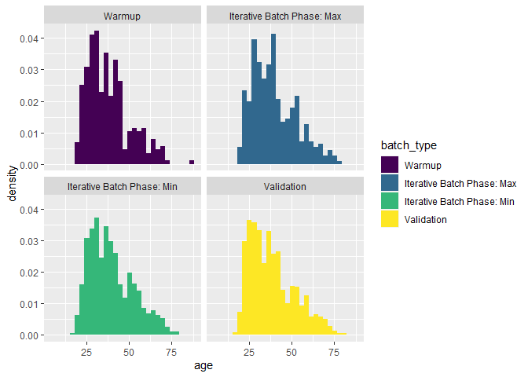
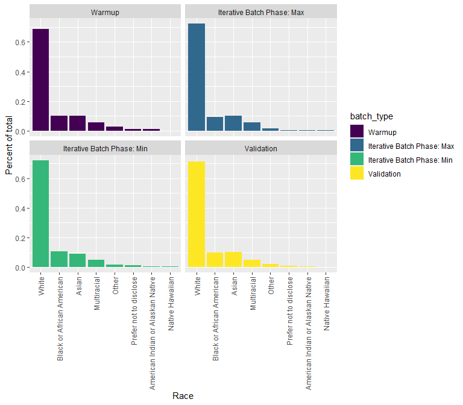

Demographic Breakdowns by Experimental Phase
================
2024-01-09

``` r
df <- readRDS("../02_output/political_candidates_data_clean.RDS")

df <- df %>% 
  mutate(batch_type = factor(batch_type, 
                             levels = c("Warmup", "Iterative Batch Phase: Max", "Iterative Batch Phase: Min", "Validation"),
                             ordered = TRUE))

# look at sample counts by batch id and batch type
df %>% 
  group_by(batch_type, batch_id) %>% 
  summarize(n = n())
```

    ## `summarise()` has grouped output by 'batch_type'. You can override using the
    ## `.groups` argument.

    ## # A tibble: 26 × 3
    ## # Groups:   batch_type [4]
    ##    batch_type                 batch_id     n
    ##    <ord>                         <dbl> <int>
    ##  1 Warmup                            0   317
    ##  2 Iterative Batch Phase: Max        1    99
    ##  3 Iterative Batch Phase: Max        2   100
    ##  4 Iterative Batch Phase: Max        3   100
    ##  5 Iterative Batch Phase: Max        4   100
    ##  6 Iterative Batch Phase: Min        1   100
    ##  7 Iterative Batch Phase: Min        2   101
    ##  8 Iterative Batch Phase: Min        3   100
    ##  9 Iterative Batch Phase: Min        4    99
    ## 10 Iterative Batch Phase: Min        5   101
    ## # ℹ 16 more rows

``` r
df %>% 
  group_by(batch_type) %>% 
  summarize(n = n())
```

    ## # A tibble: 4 × 2
    ##   batch_type                     n
    ##   <ord>                      <int>
    ## 1 Warmup                       317
    ## 2 Iterative Batch Phase: Max   399
    ## 3 Iterative Batch Phase: Min  2004
    ## 4 Validation                  1996

``` r
## look at female and hispanicity
df %>% 
  group_by(batch_type) %>% 
  summarize(across(c("female", "hispanic"), .fns = lst(n = ~sum(.),
                                                       per = ~mean(.))))
```

    ## # A tibble: 4 × 5
    ##   batch_type                 female_n female_per hispanic_n hispanic_per
    ##   <ord>                         <int>      <dbl>      <int>        <dbl>
    ## 1 Warmup                          149      0.470         36       0.114 
    ## 2 Iterative Batch Phase: Max      181      0.454         36       0.0902
    ## 3 Iterative Batch Phase: Min      962      0.480        178       0.0888
    ## 4 Validation                     1146      0.574        191       0.0957

``` r
# age
df %>% 
  group_by(batch_type, age) %>% 
  summarize(n = n()) %>% 
  group_by(batch_type) %>% 
  mutate(per = n/sum(n))
```

    ## `summarise()` has grouped output by 'batch_type'. You can override using the
    ## `.groups` argument.

    ## # A tibble: 243 × 4
    ## # Groups:   batch_type [4]
    ##    batch_type   age     n     per
    ##    <ord>      <dbl> <int>   <dbl>
    ##  1 Warmup        19     4 0.0126 
    ##  2 Warmup        20     2 0.00631
    ##  3 Warmup        21     6 0.0189 
    ##  4 Warmup        22     6 0.0189 
    ##  5 Warmup        23    10 0.0315 
    ##  6 Warmup        24    10 0.0315 
    ##  7 Warmup        25     8 0.0252 
    ##  8 Warmup        26     9 0.0284 
    ##  9 Warmup        27    13 0.0410 
    ## 10 Warmup        28     8 0.0252 
    ## # ℹ 233 more rows

``` r
df %>% 
  ggplot(aes(age, after_stat(density), fill = batch_type)) +
  geom_histogram() +
  facet_wrap(~batch_type)
```

    ## `stat_bin()` using `bins = 30`. Pick better value with `binwidth`.

    ## Warning: Removed 56 rows containing non-finite values (`stat_bin()`).

<!-- -->

``` r
# race
df %>%
  group_by(batch_type) %>% 
  group_by(race) %>% 
  summarize(n = n()) %>% 
  ungroup() %>% 
  mutate(per = n/sum(n)) %>% 
  arrange(desc(per))
```

    ## # A tibble: 8 × 3
    ##   race                                  n     per
    ##   <chr>                             <int>   <dbl>
    ## 1 White                              3374 0.715  
    ## 2 Black or African American           474 0.101  
    ## 3 Asian                               455 0.0965 
    ## 4 Multiracial                         233 0.0494 
    ## 5 Other                                96 0.0204 
    ## 6 Prefer not to disclose               48 0.0102 
    ## 7 American Indian or Alaskan Native    28 0.00594
    ## 8 Native Hawaiian                       8 0.00170

``` r
df %>%
  group_by(batch_type, race) %>% 
  summarize(n = n()) %>% 
  group_by(batch_type) %>% 
  mutate(per = n/sum(n)) %>% 
  arrange(desc(per)) %>% 
  ggplot(aes(reorder(race, desc(per)), per, fill=batch_type)) +
  geom_col() +
  facet_wrap(~batch_type) +
  labs(x = "Race",
       y = "Percent of total") +
  theme(axis.text.x = element_text(angle = 90, vjust = 0.5, hjust=1))
```

    ## `summarise()` has grouped output by 'batch_type'. You can override using the
    ## `.groups` argument.

<!-- -->
