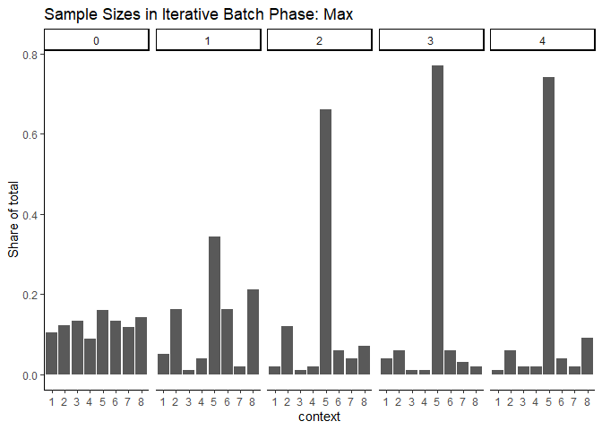
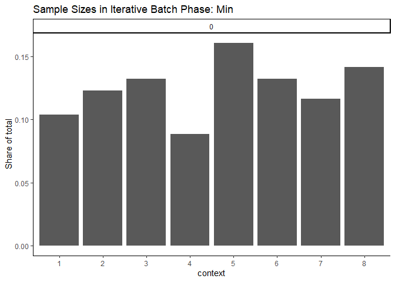

Process Qualtrics Data and Treatment Assignment Updating for Political
Candidates Survey
================
2023-11-07

# Setup Data Using Qualtrics API

- Load data directly from Qualtrics
- Can store API Key and credentials in `.renviron`

``` r
library(tidyverse)
library(qualtRics)
library(magrittr)
library(assertr)
library(RColorBrewer)

knitr::opts_chunk$set(cache.extra = 2023)

source("./_functions/data_cleaning.R")
config <- config::get()

# load log of probabilities
probabilities <- read_csv("../02_output/probabilities.csv")
probabilities
```

    ## # A tibble: 42 × 4
    ##    Batch `Embedded data variable` CDF_Threshold `Batch Type`              
    ##    <dbl> <chr>                            <dbl> <chr>                     
    ##  1     0 pi1                              0.125 Warmup                    
    ##  2     0 pi2                              0.25  Warmup                    
    ##  3     0 pi3                              0.375 Warmup                    
    ##  4     0 pi4                              0.5   Warmup                    
    ##  5     0 pi5                              0.625 Warmup                    
    ##  6     0 pi6                              0.75  Warmup                    
    ##  7     0 pi7                              0.875 Warmup                    
    ##  8     1 pi1                              0.071 Iterative Batch Phase: Max
    ##  9     1 pi2                              0.241 Iterative Batch Phase: Max
    ## 10     1 pi3                              0.264 Iterative Batch Phase: Max
    ## # ℹ 32 more rows

``` r
url <- str_glue("https://{config$datacenter_id}.qualtrics.com")
survey_name <- "Political Candidates"
current_batch_num <- 1 # numeric value for updating the batch number
current_batch_type <- "Iterative Batch Phase: Min"

# can comment out after running once
# qualtrics_api_credentials(api_key = config$api_key,
#                           base_url = url,
#                           install = TRUE,
#                           overwrite=T)

df <- load_qualtrics(survey_name)
```

    ##   |                                                                              |                                                                      |   0%  |                                                                              |===================================================================   |  96%  |                                                                              |======================================================================| 100%

    ## 
    ## ── Column specification ────────────────────────────────────────────────────────
    ## cols(
    ##   .default = col_character(),
    ##   StartDate = col_datetime(format = ""),
    ##   EndDate = col_datetime(format = ""),
    ##   Progress = col_double(),
    ##   `Duration (in seconds)` = col_double(),
    ##   Finished = col_logical(),
    ##   RecordedDate = col_datetime(format = ""),
    ##   RecipientLastName = col_logical(),
    ##   RecipientFirstName = col_logical(),
    ##   RecipientEmail = col_logical(),
    ##   ExternalReference = col_logical(),
    ##   LocationLatitude = col_double(),
    ##   LocationLongitude = col_double(),
    ##   QD2_1_TEXT = col_double(),
    ##   rnum = col_double(),
    ##   pi1 = col_double(),
    ##   pi2 = col_double(),
    ##   pi3 = col_double(),
    ##   pi4 = col_double(),
    ##   pi5 = col_double(),
    ##   pi6 = col_double()
    ##   # ... with 13 more columns
    ## )
    ## ℹ Use `spec()` for the full column specifications.

``` r
df %>%
  nrow()
```

    ## [1] 1146

``` r
# drop test data
df <- df %>%
  mutate(StartDate_clean = ymd_hms(StartDate)) %>%
  verify(is.na(StartDate_clean) == is.na(StartDate)) %>%
  filter(StartDate_clean >= ymd_hms("2023-12-26-17-56-00"))

df %>%
  nrow()
```

    ## [1] 1023

``` r
# average finished rate
mean(df$Finished)
```

    ## [1] 0.998045

``` r
# average time to complete
mean(df$`Duration (in seconds)`)
```

    ## [1] 97.81916

``` r
# compare amount of time spent
df %>%
  summarize(across(c(`Duration (in seconds)`),
    .fns = lst(
      mean = ~ mean(.) / 60,
      min = ~ min(.) / 60,
      max = ~ max(.) / 60,
      median = ~ median(.) / 60
    )
  ))
```

    ## # A tibble: 1 × 4
    ##   `Duration (in seconds)_mean` Duration (in seconds)_mi…¹ Duration (in seconds…²
    ##                          <dbl>                      <dbl>                  <dbl>
    ## 1                         1.63                      0.433                   25.6
    ## # ℹ abbreviated names: ¹​`Duration (in seconds)_min`,
    ## #   ²​`Duration (in seconds)_max`
    ## # ℹ 1 more variable: `Duration (in seconds)_median` <dbl>

## Create Batch ID variable

``` r
# hardcoding this because it should not be changing each time
# we should only update it as we increase batches
df <- df %>%
  mutate(
    batch_id = case_when(
      StartDate_clean <= ymd_hms("2023-12-26-18-48-00") ~ 0,
      StartDate_clean <= ymd_hms("2023-12-27-13-59-00") ~ 1,
      StartDate_clean <= ymd_hms("2023-12-27-14-47-00") ~ 2,
      StartDate_clean <= ymd_hms("2023-12-27-15-33-00") ~ 3,
      StartDate_clean <= ymd_hms("2023-12-27-16-54-00") ~ 4,
      TRUE ~ NA_integer_
    ),
    batch_type = case_when(
      batch_id == 0 ~ "Warmup",
      StartDate_clean <= ymd_hms("2023-12-27-16-54-00") ~ "Iterative Batch Phase: Max",
      StartDate_clean > ymd_hms("2023-12-27-16-54-00") ~ "Iterative Batch Phase: Min",
      TRUE ~ NA_character_
    )
  ) %>%
  # drop data collected incorrectly
  filter(StartDate_clean <= ymd_hms("2023-12-27-16-54-00") | StartDate_clean >= ymd_hms("2024-01-03-00-00-00")) %>% 
  verify(!is.na(batch_id)) 

df %>%
  group_by(batch_id, batch_type) %>%
  summarize(n = n())
```

    ## `summarise()` has grouped output by 'batch_id'. You can override using the
    ## `.groups` argument.

    ## # A tibble: 5 × 3
    ## # Groups:   batch_id [5]
    ##   batch_id batch_type                     n
    ##      <dbl> <chr>                      <int>
    ## 1        0 Warmup                       323
    ## 2        1 Iterative Batch Phase: Max    99
    ## 3        2 Iterative Batch Phase: Max   100
    ## 4        3 Iterative Batch Phase: Max   100
    ## 5        4 Iterative Batch Phase: Max   100

## Survey Validation

``` r
# check ID uniquely identifies rows in data
if (length(unique(df$`Prolific ID Q`)) != nrow(df)) {
  print("ID is not unique")
}
```

    ## [1] "ID is not unique"

``` r
if (unique(df$Status) != "IP Address") {
  print("Test data included in the analysis file")
}
```

``` r
# check embedded data variables match probabilities for all iterative batches
df %>%
  check_pi_vars(probabilities, 7)
```

    ## # A tibble: 35 × 6
    ##    batch_id batch_type  Embedded data variab…¹ CDF_Data CDF_Threshold Comparison
    ##       <dbl> <chr>       <chr>                     <dbl>         <dbl> <lgl>     
    ##  1        0 Warmup      pi1                       0.125         0.125 TRUE      
    ##  2        0 Warmup      pi2                       0.25          0.25  TRUE      
    ##  3        0 Warmup      pi3                       0.375         0.375 TRUE      
    ##  4        0 Warmup      pi4                       0.5           0.5   TRUE      
    ##  5        0 Warmup      pi5                       0.625         0.625 TRUE      
    ##  6        0 Warmup      pi6                       0.75          0.75  TRUE      
    ##  7        0 Warmup      pi7                       0.875         0.875 TRUE      
    ##  8        1 Iterative … pi1                       0.071         0.071 TRUE      
    ##  9        1 Iterative … pi2                       0.241         0.241 TRUE      
    ## 10        1 Iterative … pi3                       0.264         0.264 TRUE      
    ## # ℹ 25 more rows
    ## # ℹ abbreviated name: ¹​`Embedded data variable`

``` r
# check consent means their responses are missing
# df %>%
#   filter(Consent == "I do not consent to participate")

df <- df %>%
  check_consent()
```

    ## Warning in check_consent(.): Dropping 1 survey respondents who do not consent

    ## Warning in check_consent(.): 1 survey respondents who do not consent with
    ## non-missing responses

    ## Warning in check_consent(.): 721 respondents in the data

``` r
# check that all completed
df <- df %>%
  check_completion()
```

    ## Warning in check_completion(.): Dropping 2 survey respondents who did not
    ## finish

    ## Warning in check_completion(.): 719 respondents in the data

``` r
df <- df %>%
  check_location_screen()
```

``` r
# visually assessing why these respondents failed the commitment check
# df %>%
#   filter(Commitment_Q1 != "Yes, I will")
# 
# df %>%
#   filter(str_to_lower(Commitment_Q2) != "purple")

df <- df %>%
  check_commitment()
```

    ## Warning in check_commitment(.): Dropping 1 survey respondents did not pass
    ## commitment check 1

    ## Warning in check_commitment(.): 718 respondents in the data

    ## Warning in check_commitment(.): Dropping 2 survey respondents who did not pass
    ## commitment check 2

    ## Warning in check_commitment(.): 716 respondents in the data

``` r
# create context variable
df <- df %>%
  create_context_var_political()

df %>%
  group_by(batch_type, context) %>%
  summarize(n = n())
```

    ## `summarise()` has grouped output by 'batch_type'. You can override using the
    ## `.groups` argument.

    ## # A tibble: 16 × 3
    ## # Groups:   batch_type [2]
    ##    batch_type                 context     n
    ##    <chr>                      <ord>   <int>
    ##  1 Iterative Batch Phase: Max 1          12
    ##  2 Iterative Batch Phase: Max 2          40
    ##  3 Iterative Batch Phase: Max 3           5
    ##  4 Iterative Batch Phase: Max 4           9
    ##  5 Iterative Batch Phase: Max 5         251
    ##  6 Iterative Batch Phase: Max 6          32
    ##  7 Iterative Batch Phase: Max 7          11
    ##  8 Iterative Batch Phase: Max 8          39
    ##  9 Warmup                     1          33
    ## 10 Warmup                     2          39
    ## 11 Warmup                     3          42
    ## 12 Warmup                     4          28
    ## 13 Warmup                     5          51
    ## 14 Warmup                     6          42
    ## 15 Warmup                     7          37
    ## 16 Warmup                     8          45

``` r
df %>%
  group_by(batch_id, batch_type) %>%
  summarize(n = n())
```

    ## `summarise()` has grouped output by 'batch_id'. You can override using the
    ## `.groups` argument.

    ## # A tibble: 5 × 3
    ## # Groups:   batch_id [5]
    ##   batch_id batch_type                     n
    ##      <dbl> <chr>                      <int>
    ## 1        0 Warmup                       317
    ## 2        1 Iterative Batch Phase: Max    99
    ## 3        2 Iterative Batch Phase: Max   100
    ## 4        3 Iterative Batch Phase: Max   100
    ## 5        4 Iterative Batch Phase: Max   100

``` r
# check ID is unique again
if (length(unique(df$`Prolific ID Q`)) != nrow(df)) {
  print("ID is not unique")
}
```

``` r
df %>%
  group_by(context, batch_type, batch_id) %>%
  filter(batch_type %in% c("Warmup", "Iterative Batch Phase: Max")) %>% 
  summarize(n = n()) %>%
  group_by(batch_type, batch_id) %>% 
  mutate(n = n/sum(n)) %>% 
  ggplot(aes(context, n)) +
  geom_col() +
  theme_classic() +
  facet_grid(cols = vars(batch_id))  +
  labs(title = "Sample Sizes in Iterative Batch Phase: Max",
       y = "Share of total")
```

    ## `summarise()` has grouped output by 'context', 'batch_type'. You can override
    ## using the `.groups` argument.

<!-- -->

``` r
df %>%
  group_by(context, batch_type, batch_id) %>%
  filter(batch_type %in% c("Warmup", "Iterative Batch Phase: Min")) %>% 
  summarize(n = n()) %>%
  group_by(batch_type, batch_id) %>% 
  mutate(n = n/sum(n)) %>%
  ggplot(aes(context, n)) +
  geom_col() +
  theme_classic() +
  facet_grid(cols = vars(batch_id)) +
  labs(title = "Sample Sizes in Iterative Batch Phase: Min",
       y = "Share of total")
```

    ## `summarise()` has grouped output by 'context', 'batch_type'. You can override
    ## using the `.groups` argument.

<!-- -->

``` r
df %>%
  group_by(context, batch_type, batch_id) %>%
  filter(batch_type %in% c("Warmup", "Iterative Batch Phase: Max")) %>% 
  summarize(n = n()) %>%
  group_by(batch_id, batch_type) %>% 
  arrange(context) %>% 
  mutate(n = cumsum(n)/sum(n))  %>% 
  ggplot(aes(context, n)) +
  geom_col() +
  theme_classic() +
  facet_grid(cols = vars(batch_id))  +
  labs(title = "Cumulative Sample Sizes in Iterative Batch Phase: Max")
```

    ## `summarise()` has grouped output by 'context', 'batch_type'. You can override
    ## using the `.groups` argument.

<!-- -->

``` r
df %>%
  group_by(context, batch_type, batch_id) %>%
  filter(batch_type %in% c("Warmup", "Iterative Batch Phase: Min")) %>% 
  summarize(n = n()) %>%
  group_by(batch_id, batch_type) %>% 
  arrange(context) %>% 
  mutate(n = cumsum(n)/sum(n))  %>% 
  ggplot(aes(context, n)) +
  geom_col() +
  theme_classic() +
  facet_grid(cols = vars(batch_id))  +
  labs(title = "Cumulative Sample Sizes in Iterative Batch Phase: Min")
```

    ## `summarise()` has grouped output by 'context', 'batch_type'. You can override
    ## using the `.groups` argument.

<!-- -->

``` r
df  %>%
  filter(batch_type %in% c("Warmup", "Iterative Batch Phase: Max")) %>%
  group_by(batch_id, batch_type) %>%
  select(str_c("pi", 1:7)) %>% 
  distinct() %>% 
  pivot_longer(-c(batch_id, batch_type)) %>% 
  mutate(context = str_replace_all(name, "pi", "")) %>%
  ggplot(aes(context, value)) +
  geom_col() +
  theme_classic() +
  facet_grid(cols = vars(batch_id))
```

    ## Adding missing grouping variables: `batch_id`, `batch_type`

<!-- -->

``` r
df  %>%
  filter(batch_type %in% c("Warmup", "Iterative Batch Phase: Min")) %>% 
  group_by(batch_id, batch_type) %>%
  select(str_c("pi", 1:7)) %>% 
  distinct() %>% 
  pivot_longer(-c(batch_id, batch_type)) %>% 
  mutate(context = str_replace_all(name, "pi", "")) %>%
  ggplot(aes(context, value)) +
  geom_col() +
  theme_classic() +
  facet_grid(cols = vars(batch_id)) +
  labs(title = "CDF for Iterative Batch Phase: Min",
       y = "Cumulative Probability")
```

    ## Adding missing grouping variables: `batch_id`, `batch_type`

<!-- -->

## Clean Qualtrics Data

``` r
df_clean <- create_outcome_var_political(df)

# each question number is the random ordering of the context attributes
df_clean %>%
  select(chose_younger, str_c("Q", 1:8), context) %>%
  verify(!is.na(chose_younger))
```

    ## # A tibble: 716 × 10
    ##    chose_younger    Q1    Q2    Q3    Q4    Q5    Q6    Q7    Q8 context
    ##            <dbl> <dbl> <dbl> <dbl> <dbl> <dbl> <dbl> <dbl> <dbl> <ord>  
    ##  1             1    NA    NA    NA     1    NA    NA    NA    NA 6      
    ##  2             1     1    NA    NA    NA    NA    NA    NA    NA 2      
    ##  3             1    NA    NA    NA    NA    NA    NA     1    NA 3      
    ##  4             1    NA    NA    NA    NA    NA    NA    NA     1 2      
    ##  5             0    NA    NA    NA    NA    NA     0    NA    NA 1      
    ##  6             1    NA    NA     1    NA    NA    NA    NA    NA 2      
    ##  7             1    NA    NA    NA    NA    NA    NA     1    NA 5      
    ##  8             1    NA    NA    NA     1    NA    NA    NA    NA 5      
    ##  9             0    NA     0    NA    NA    NA    NA    NA    NA 6      
    ## 10             1    NA     1    NA    NA    NA    NA    NA    NA 5      
    ## # ℹ 706 more rows

``` r
df_clean %>%
  group_by(context) %>%
  summarize(
    n = n(),
    resp1 = sum(chose_younger),
    resp0 = sum(chose_younger == 0)
  )
```

    ## # A tibble: 8 × 4
    ##   context     n resp1 resp0
    ##   <ord>   <int> <dbl> <int>
    ## 1 1          45    33    12
    ## 2 2          79    57    22
    ## 3 3          47    32    15
    ## 4 4          37    26    11
    ## 5 5         302   238    64
    ## 6 6          74    54    20
    ## 7 7          48    34    14
    ## 8 8          84    62    22

``` r
# identify context desc
df_clean %>%
  select(context, starts_with("first_name"), starts_with("pol_exp")) %>%
  distinct() %>%
  arrange(context)
```

    ## # A tibble: 8 × 5
    ##   context first_name1     first_name2       pol_exp1           pol_exp2        
    ##   <ord>   <chr>           <chr>             <chr>              <chr>           
    ## 1 1       Laurie Schmitt  Allison O'Connell Member of Congress State legislator
    ## 2 2       Laurie Schmitt  Allison O'Connell No experience      No experience   
    ## 3 3       Tanisha Rivers  Keisha Mosely     Member of Congress State legislator
    ## 4 4       Tanisha Rivers  Keisha Mosely     No experience      No experience   
    ## 5 5       Tremayne Rivers Rasheed Mosely    Member of Congress State legislator
    ## 6 6       Tremayne Rivers Rasheed Mosely    No experience      No experience   
    ## 7 7       Brendan Schmitt Jay O'Connell     Member of Congress State legislator
    ## 8 8       Brendan Schmitt Jay O'Connell     No experience      No experience

``` r
df_clean %>%
  mutate(older_candidate = if_else(rnum_age <= 0.5, "Candidate 2", "Candidate 1")) %>%
  mutate(pass_attention_check = if_else(Manipulation_Q1 == older_candidate, 1, 0)) %>%
  summarize(per_pass_attention_check = mean(pass_attention_check))
```

    ## # A tibble: 1 × 1
    ##   per_pass_attention_check
    ##                      <dbl>
    ## 1                    0.964

``` r
df_clean <- df_clean %>%
  verify(is.numeric(QD2_1_TEXT)) %>%
  rename(age = QD2_1_TEXT) %>%
  mutate(
    hispanic = if_else(QD4 == "Yes", TRUE, FALSE),
    female = if_else(QD5 == "Female", TRUE, FALSE)
  ) %>%
  mutate(across(starts_with("QD3_"), .fns = lst(race_num = ~ if_else(!is.na(.), 1, 0)))) %>%
  mutate(
    race_count = rowSums(select(., ends_with("race_num"))),
    race = case_when(
      race_count > 1 ~ "Multiracial",
      !is.na(QD3_1) ~ "American Indian or Alaskan Native",
      !is.na(QD3_2) ~ "Asian",
      !is.na(QD3_3) ~ "Black or African American",
      !is.na(QD3_4) ~ "Native Hawaiian",
      !is.na(QD3_5) ~ "White",
      !is.na(QD3_6) ~ "Other",
      !is.na(QD3_7) ~ "Prefer not to disclose"
    )
  ) %>%
  verify(!is.na(race))

df_clean %>%
  group_by(race) %>%
  summarize(n = n()) %>%
  ungroup() %>%
  mutate(per = n / sum(n)) %>%
  arrange(desc(per))
```

    ## # A tibble: 8 × 3
    ##   race                                  n     per
    ##   <chr>                             <int>   <dbl>
    ## 1 White                               506 0.707  
    ## 2 Asian                                73 0.102  
    ## 3 Black or African American            69 0.0964 
    ## 4 Multiracial                          40 0.0559 
    ## 5 Other                                16 0.0223 
    ## 6 American Indian or Alaskan Native     5 0.00698
    ## 7 Prefer not to disclose                5 0.00698
    ## 8 Native Hawaiian                       2 0.00279

``` r
df_clean %>%
  ggplot(aes(age)) +
  geom_histogram()
```

    ## `stat_bin()` using `bins = 30`. Pick better value with `binwidth`.

    ## Warning: Removed 5 rows containing non-finite values (`stat_bin()`).

<!-- -->

``` r
df_clean %>%
  group_by(female) %>%
  summarize(count = n())
```

    ## # A tibble: 2 × 2
    ##   female count
    ##   <lgl>  <int>
    ## 1 FALSE    386
    ## 2 TRUE     330

``` r
df_clean %>%
  summarize(
    count_hispanic = sum(hispanic),
    per_hispanic = mean(hispanic)
  )
```

    ## # A tibble: 1 × 2
    ##   count_hispanic per_hispanic
    ##            <int>        <dbl>
    ## 1             72        0.101

## Clean Data Validation

``` r
# check every respondent has exactly one non-missing value
check_allmissing <- df_clean %>%
  select(str_c("Q", 1:8)) %>%
  mutate(across(everything(), ~ as.character(.))) %>%
  is.na() %>%
  rowSums(na.rm = T) %>%
  equals(8) %>%
  any()

if (check_allmissing == TRUE) {
  warning("Some rows are missing outcome responses\n")
}

# check row total is not more than 1
# 0 if selected the older candidate
check_rowtotal <- df_clean %>%
  select(str_c("Q", 1:8)) %>%
  rowSums(na.rm = T) %>%
  is_weakly_less_than(1) %>%
  all()

if (check_rowtotal == FALSE) {
  warning("Total of outcome responses is more than 1\n")
}
```

``` r
df_clean %>%
  select(context, context_label, batch_id, batch_type, chose_younger, race, age, female, hispanic) %>%
  saveRDS("../02_output/political_candidates_data_clean.RDS")

df_clean %>%
  select(context, context_label, batch_id, batch_type, chose_younger, race, age, female, hispanic) %>%
  write_csv("../02_output/political_candidates_data_clean.csv")
```
