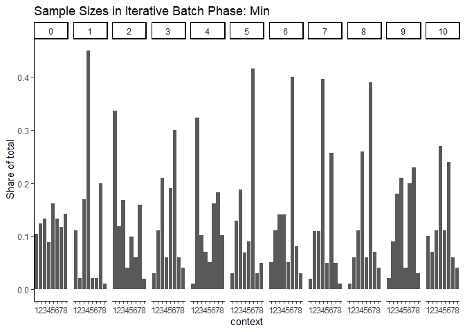
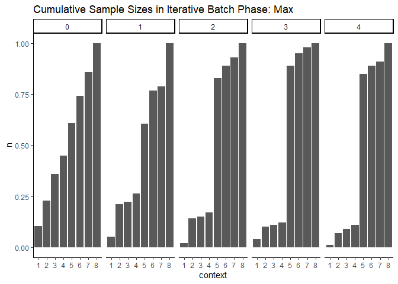
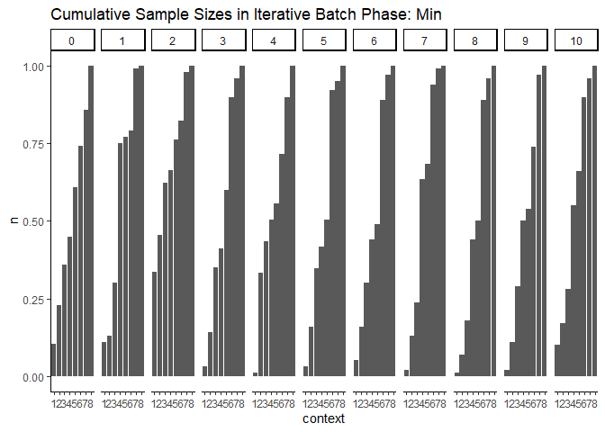
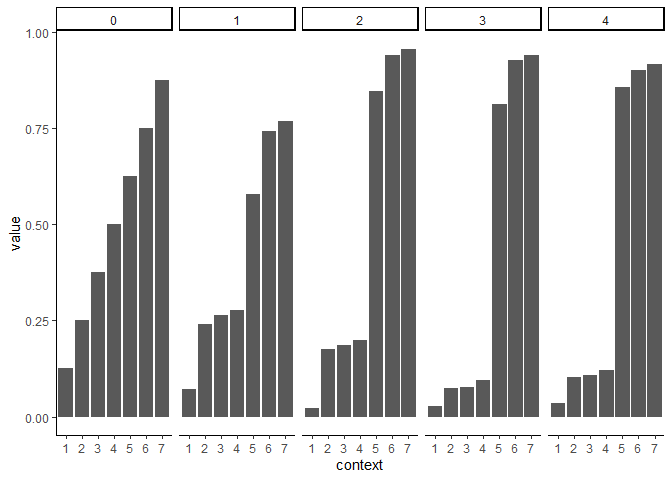
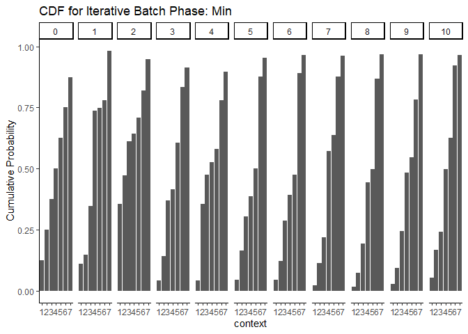
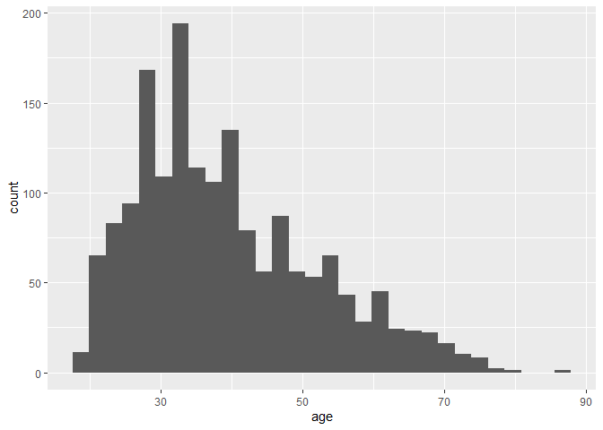

Process Qualtrics Data and Treatment Assignment Updating for Political
Candidates Survey
================
2023-11-07

# Setup Data Using Qualtrics API

- Load data directly from Qualtrics
- Can store API Key and credentials in `.renviron`

``` r
library(tidyverse)
library(qualtRics)
library(magrittr)
library(assertr)
library(RColorBrewer)

knitr::opts_chunk$set(cache.extra = 2023)

source("./_functions/data_cleaning.R")
config <- config::get()

# load log of probabilities
probabilities <- read_csv("../02_output/probabilities.csv")
probabilities
```

    ## # A tibble: 112 × 4
    ##    Batch `Embedded data variable` CDF_Threshold `Batch Type`              
    ##    <dbl> <chr>                            <dbl> <chr>                     
    ##  1     0 pi1                              0.125 Warmup                    
    ##  2     0 pi2                              0.25  Warmup                    
    ##  3     0 pi3                              0.375 Warmup                    
    ##  4     0 pi4                              0.5   Warmup                    
    ##  5     0 pi5                              0.625 Warmup                    
    ##  6     0 pi6                              0.75  Warmup                    
    ##  7     0 pi7                              0.875 Warmup                    
    ##  8     1 pi1                              0.071 Iterative Batch Phase: Max
    ##  9     1 pi2                              0.241 Iterative Batch Phase: Max
    ## 10     1 pi3                              0.264 Iterative Batch Phase: Max
    ## # ℹ 102 more rows

``` r
url <- str_glue("https://{config$datacenter_id}.qualtrics.com")
survey_name <- "Political Candidates"

# can comment out after running once
# qualtrics_api_credentials(api_key = config$api_key,
#                           base_url = url,
#                           install = TRUE,
#                           overwrite=T)

df <- load_qualtrics(survey_name)
```

    ##   |                                                                              |                                                                      |   0%  |                                                                              |======                                                                |   9%  |                                                                              |================================                                      |  46%  |                                                                              |==============================================================        |  88%  |                                                                              |======================================================================| 100%

    ## 
    ## ── Column specification ────────────────────────────────────────────────────────
    ## cols(
    ##   .default = col_character(),
    ##   StartDate = col_datetime(format = ""),
    ##   EndDate = col_datetime(format = ""),
    ##   Progress = col_double(),
    ##   `Duration (in seconds)` = col_double(),
    ##   Finished = col_logical(),
    ##   RecordedDate = col_datetime(format = ""),
    ##   RecipientLastName = col_logical(),
    ##   RecipientFirstName = col_logical(),
    ##   RecipientEmail = col_logical(),
    ##   ExternalReference = col_logical(),
    ##   LocationLatitude = col_double(),
    ##   LocationLongitude = col_double(),
    ##   QD2_1_TEXT = col_double(),
    ##   rnum = col_double(),
    ##   pi1 = col_double(),
    ##   pi2 = col_double(),
    ##   pi3 = col_double(),
    ##   pi4 = col_double(),
    ##   pi5 = col_double(),
    ##   pi6 = col_double()
    ##   # ... with 13 more columns
    ## )
    ## ℹ Use `spec()` for the full column specifications.

``` r
df %>%
  nrow()
```

    ## [1] 2158

``` r
# drop test data
df <- df %>%
  mutate(StartDate_clean = ymd_hms(StartDate)) %>%
  verify(is.na(StartDate_clean) == is.na(StartDate)) %>%
  filter(StartDate_clean >= ymd_hms("2023-12-26-17-56-00"))

df %>%
  nrow()
```

    ## [1] 2035

``` r
# average finished rate
mean(df$Finished)
```

    ## [1] 0.9960688

``` r
# average time to complete
mean(df$`Duration (in seconds)`)
```

    ## [1] 96.65651

``` r
# compare amount of time spent
df %>%
  summarize(across(c(`Duration (in seconds)`),
    .fns = lst(
      mean = ~ mean(.) / 60,
      min = ~ min(.) / 60,
      max = ~ max(.) / 60,
      median = ~ median(.) / 60
    )
  ))
```

    ## # A tibble: 1 × 4
    ##   `Duration (in seconds)_mean` Duration (in seconds)_mi…¹ Duration (in seconds…²
    ##                          <dbl>                      <dbl>                  <dbl>
    ## 1                         1.61                      0.433                   25.6
    ## # ℹ abbreviated names: ¹​`Duration (in seconds)_min`,
    ## #   ²​`Duration (in seconds)_max`
    ## # ℹ 1 more variable: `Duration (in seconds)_median` <dbl>

## Create Batch ID variable

``` r
# hardcoding this because it should not be changing each time
# we should only update it as we increase batches

# check max date times on each day
df %>% 
  mutate(date = date(StartDate_clean)) %>% 
  group_by(date) %>% 
  summarize(max_date_time = max(StartDate_clean))
```

    ## # A tibble: 6 × 2
    ##   date       max_date_time      
    ##   <date>     <dttm>             
    ## 1 2023-12-26 2023-12-26 18:45:16
    ## 2 2023-12-27 2023-12-27 16:49:41
    ## 3 2023-12-30 2023-12-30 11:00:19
    ## 4 2024-01-02 2024-01-02 15:04:43
    ## 5 2024-01-03 2024-01-03 18:00:25
    ## 6 2024-01-04 2024-01-04 15:26:51

``` r
df <- df %>%
  # drop data collected incorrectly
  filter(StartDate_clean <= ymd_hms("2023-12-27-16-54-00") | StartDate_clean >= ymd_hms("2024-01-03-00-00-00")) %>%
  mutate(
    batch_id = case_when(
      StartDate_clean <= ymd_hms("2023-12-26-18-48-00") ~ 0,
      StartDate_clean <= ymd_hms("2023-12-27-13-59-00") ~ 1,
      StartDate_clean <= ymd_hms("2023-12-27-14-47-00") ~ 2,
      StartDate_clean <= ymd_hms("2023-12-27-15-33-00") ~ 3,
      StartDate_clean <= ymd_hms("2023-12-27-16-54-00") ~ 4,
      StartDate_clean <= ymd_hms("2024-01-03-12-43-00") ~ 1,
      StartDate_clean <= ymd_hms("2024-01-03-16-32-00") ~ 2,
      StartDate_clean <= ymd_hms("2024-01-03-17-02-00") ~ 3,
      StartDate_clean <= ymd_hms("2024-01-03-17-21-00") ~ 4,
      StartDate_clean <= ymd_hms("2024-01-03-18-05-00") ~ 5,
      StartDate_clean <= ymd_hms("2024-01-04-10-05-00") ~ 6,
      StartDate_clean <= ymd_hms("2024-01-04-10-55-00") ~ 7,
      StartDate_clean <= ymd_hms("2024-01-04-11-58-00") ~ 8,
      StartDate_clean <= ymd_hms("2024-01-04-12-33-00") ~ 9,
      StartDate_clean <= ymd_hms("2024-01-04-15-30-00") ~ 10,
      TRUE ~ NA_integer_
    ),
    batch_type = case_when(
      batch_id == 0 ~ "Warmup",
      StartDate_clean <= ymd_hms("2023-12-27-16-54-00") ~ "Iterative Batch Phase: Max",
      StartDate_clean > ymd_hms("2023-12-27-16-54-00") ~ "Iterative Batch Phase: Min",
      TRUE ~ NA_character_
    )
  ) %>% 
  verify(!is.na(batch_id)) %>% 
  verify(!is.na(batch_type))

df %>%
  group_by(batch_type, batch_id) %>%
  summarize(n = n())
```

    ## `summarise()` has grouped output by 'batch_type'. You can override using the
    ## `.groups` argument.

    ## # A tibble: 15 × 3
    ## # Groups:   batch_type [3]
    ##    batch_type                 batch_id     n
    ##    <chr>                         <dbl> <int>
    ##  1 Iterative Batch Phase: Max        1   102
    ##  2 Iterative Batch Phase: Max        2   100
    ##  3 Iterative Batch Phase: Max        3   102
    ##  4 Iterative Batch Phase: Max        4   101
    ##  5 Iterative Batch Phase: Min        1   101
    ##  6 Iterative Batch Phase: Min        2   101
    ##  7 Iterative Batch Phase: Min        3   100
    ##  8 Iterative Batch Phase: Min        4    99
    ##  9 Iterative Batch Phase: Min        5   101
    ## 10 Iterative Batch Phase: Min        6   101
    ## 11 Iterative Batch Phase: Min        7   101
    ## 12 Iterative Batch Phase: Min        8   100
    ## 13 Iterative Batch Phase: Min        9   102
    ## 14 Iterative Batch Phase: Min       10   100
    ## 15 Warmup                            0   323

## Survey Validation

``` r
# check ID uniquely identifies rows in data
if (length(unique(df$`Prolific ID Q`)) != nrow(df)) {
  warning("ID is not unique")
}
```

    ## Warning: ID is not unique

``` r
if (!all(unique(df$Status) == "IP Address")) {
  warning("Test/spam data included in the analysis file")
  print(str_glue("Number of observations in data: {nrow(df)}"))
  print(str_glue("Status values in data: {str_c(unique(df$Status), collapse=', ')}"))
  df <- df %>% 
    filter(Status == "IP Address")
  print(str_glue("Number of observations left in data: {nrow(df)}"))
}
```

    ## Warning: Test/spam data included in the analysis file

    ## Number of observations in data: 1734
    ## Status values in data: IP Address, Spam
    ## Number of observations left in data: 1733

``` r
# check embedded data variables match probabilities for all iterative batches
df %>%
  check_pi_vars(probabilities, 7)
```

``` r
# check distinct probabilities based on embedded data
df %>% 
  select(batch_id, str_c("pi", 1:7)) %>% 
  distinct()
```

    ## # A tibble: 15 × 8
    ##    batch_id   pi1   pi2   pi3   pi4   pi5   pi6   pi7
    ##       <dbl> <dbl> <dbl> <dbl> <dbl> <dbl> <dbl> <dbl>
    ##  1        0 0.125 0.25  0.375 0.5   0.625 0.75  0.875
    ##  2        1 0.071 0.241 0.264 0.277 0.579 0.741 0.768
    ##  3        2 0.023 0.176 0.186 0.199 0.845 0.94  0.955
    ##  4        3 0.028 0.073 0.078 0.094 0.813 0.925 0.94 
    ##  5        4 0.035 0.102 0.108 0.12  0.856 0.901 0.916
    ##  6        1 0.111 0.146 0.346 0.738 0.748 0.781 0.982
    ##  7        2 0.355 0.471 0.612 0.642 0.708 0.821 0.949
    ##  8        3 0.042 0.143 0.369 0.416 0.607 0.833 0.914
    ##  9        4 0.041 0.355 0.476 0.525 0.579 0.78  0.896
    ## 10        5 0.045 0.165 0.303 0.386 0.501 0.876 0.953
    ## 11        6 0.045 0.123 0.288 0.392 0.474 0.891 0.965
    ## 12        7 0.022 0.112 0.218 0.572 0.637 0.878 0.963
    ## 13        8 0.017 0.073 0.193 0.444 0.498 0.869 0.968
    ## 14        9 0.027 0.093 0.243 0.484 0.547 0.783 0.968
    ## 15       10 0.052 0.166 0.24  0.497 0.625 0.922 0.966

``` r
# check consent means their responses are missing
df %>%
  filter(Consent == "I do not consent to participate") %>% 
    select(Consent, `Duration (in seconds)`, Finished, batch_id, batch_type)
```

    ## # A tibble: 1 × 5
    ##   Consent                    Duration (in seconds…¹ Finished batch_id batch_type
    ##   <ord>                                       <dbl> <lgl>       <dbl> <chr>     
    ## 1 I do not consent to parti…                     65 TRUE            0 Warmup    
    ## # ℹ abbreviated name: ¹​`Duration (in seconds)`

``` r
df <- df %>%
  check_consent()
```

    ## Warning in check_consent(.): Dropping 1 survey respondents who do not consent

    ## Warning in check_consent(.): 1 survey respondents who do not consent with
    ## non-missing responses

    ## Warning in check_consent(.): 1732 respondents in the data

``` r
# check that all completed
df %>%
  filter(Finished != TRUE) %>% 
  select(StartDate_clean, EndDate, `Duration (in seconds)`, Finished, Consent, PreScreen_Q1:QD5)
```

    ## # A tibble: 8 × 28
    ##   StartDate_clean     EndDate             `Duration (in seconds)` Finished
    ##   <dttm>              <dttm>                                <dbl> <lgl>   
    ## 1 2023-12-26 18:05:04 2023-12-26 18:06:21                      76 FALSE   
    ## 2 2023-12-26 18:14:20 2023-12-26 18:14:50                      30 FALSE   
    ## 3 2023-12-27 13:46:11 2023-12-27 13:46:57                      45 FALSE   
    ## 4 2023-12-27 13:46:30 2023-12-27 13:49:07                     156 FALSE   
    ## 5 2023-12-27 13:48:07 2023-12-27 13:53:26                     319 FALSE   
    ## 6 2023-12-27 15:20:43 2023-12-27 15:21:26                      42 FALSE   
    ## 7 2023-12-27 15:20:33 2023-12-27 15:21:42                      68 FALSE   
    ## 8 2023-12-27 16:44:17 2023-12-27 16:45:28                      71 FALSE   
    ## # ℹ 24 more variables: Consent <ord>, PreScreen_Q1 <ord>, Commitment_Q1 <ord>,
    ## #   Commitment_Q2 <chr>, Q1 <ord>, Q2 <ord>, Q3 <ord>, Q4 <ord>, Q5 <ord>,
    ## #   Q6 <ord>, Q7 <ord>, Q8 <ord>, Manipulation_Q1 <ord>, QD2 <ord>,
    ## #   QD2_1_TEXT <dbl>, QD3_1 <chr>, QD3_2 <chr>, QD3_3 <chr>, QD3_4 <chr>,
    ## #   QD3_5 <chr>, QD3_6 <chr>, QD3_7 <chr>, QD4 <ord>, QD5 <ord>

``` r
df <- df %>%
  check_completion()
```

    ## Warning in check_completion(.): Dropping 8 survey respondents who did not
    ## finish

    ## Warning in check_completion(.): 1724 respondents in the data

``` r
df <- df %>%
  check_location_screen()
```

``` r
# visually assessing why these respondents failed the commitment check
df %>%
  filter(Commitment_Q1 != "Yes, I will") %>% 
    select(Commitment_Q1, Commitment_Q2, `Duration (in seconds)`, Finished, batch_id, batch_type)
```

    ## # A tibble: 1 × 6
    ##   Commitment_Q1           Commitment_Q2 Duration (in seconds…¹ Finished batch_id
    ##   <ord>                   <chr>                          <dbl> <lgl>       <dbl>
    ## 1 I can't promise either… purple                            88 TRUE            0
    ## # ℹ abbreviated name: ¹​`Duration (in seconds)`
    ## # ℹ 1 more variable: batch_type <chr>

``` r
df %>%
  filter(str_to_lower(Commitment_Q2) != "purple") %>% 
    select(Commitment_Q1, Commitment_Q2, `Duration (in seconds)`, Finished, batch_id, batch_type)
```

    ## # A tibble: 2 × 6
    ##   Commitment_Q1 Commitment_Q2           Duration (in seconds…¹ Finished batch_id
    ##   <ord>         <chr>                                    <dbl> <lgl>       <dbl>
    ## 1 Yes, I will   6459b8128544c7f22edba1…                     99 TRUE            0
    ## 2 Yes, I will   pur                                         63 TRUE            0
    ## # ℹ abbreviated name: ¹​`Duration (in seconds)`
    ## # ℹ 1 more variable: batch_type <chr>

``` r
df <- df %>%
  check_commitment()
```

    ## Warning in check_commitment(.): Dropping 1 survey respondents did not pass
    ## commitment check 1

    ## Warning in check_commitment(.): 1723 respondents in the data

    ## Warning in check_commitment(.): Dropping 2 survey respondents who did not pass
    ## commitment check 2

    ## Warning in check_commitment(.): 1721 respondents in the data

``` r
# check ID is unique again
if (length(unique(df$`Prolific ID Q`)) != nrow(df)) {
  warning("ID is not unique")
  print(str_glue("Number of rows in data: {nrow(df)}"))
  df <- df %>% 
    group_by(`Prolific ID Q`) %>% 
    arrange(`Prolific ID Q`, StartDate_clean) %>% 
    mutate(flag_first_obs = if_else(row_number() == 1, 1, 0)) %>% 
    ungroup()
  
  df %>% 
    group_by(`Prolific ID Q`) %>% 
    mutate(n = n()) %>% 
    arrange(desc(n), StartDate_clean) %>% 
    ungroup() %>% 
    select(n, StartDate_clean, EndDate, flag_first_obs, `Duration (in seconds)`, Finished, batch_id, batch_type) %>% 
    print()
  
  df <- df %>% 
    filter(flag_first_obs == 1)
  
  print(str_glue("Number of rows in data after dropping duplicate ID: {nrow(df)}"))
}
```

    ## Warning: ID is not unique

    ## Number of rows in data: 1721
    ## # A tibble: 1,721 × 8
    ##        n StartDate_clean     EndDate             flag_first_obs
    ##    <int> <dttm>              <dttm>                       <dbl>
    ##  1     2 2024-01-03 12:29:24 2024-01-03 12:31:07              1
    ##  2     2 2024-01-03 12:31:17 2024-01-03 12:33:13              0
    ##  3     2 2024-01-04 09:54:05 2024-01-04 09:55:22              1
    ##  4     2 2024-01-04 09:55:45 2024-01-04 09:56:47              0
    ##  5     2 2024-01-04 12:12:57 2024-01-04 12:13:43              1
    ##  6     2 2024-01-04 12:13:50 2024-01-04 12:14:29              0
    ##  7     1 2023-12-26 18:01:49 2023-12-26 18:03:03              1
    ##  8     1 2023-12-26 18:01:49 2023-12-26 18:02:38              1
    ##  9     1 2023-12-26 18:01:49 2023-12-26 18:02:59              1
    ## 10     1 2023-12-26 18:01:54 2023-12-26 18:02:47              1
    ## # ℹ 1,711 more rows
    ## # ℹ 4 more variables: `Duration (in seconds)` <dbl>, Finished <lgl>,
    ## #   batch_id <dbl>, batch_type <chr>
    ## Number of rows in data after dropping duplicate ID: 1718

``` r
stopifnot(length(unique(df$`Prolific ID Q`)) == nrow(df))
```

## Create Context and Context Label Variables

``` r
# create context variable
df <- df %>%
  create_context_var_political() %>% 
  verify(!is.na(context)) %>% 
  verify(!is.na(context_label))

df %>%
  group_by(batch_type, context) %>%
  summarize(n = n())
```

    ## `summarise()` has grouped output by 'batch_type'. You can override using the
    ## `.groups` argument.

    ## # A tibble: 24 × 3
    ## # Groups:   batch_type [3]
    ##    batch_type                 context     n
    ##    <chr>                      <ord>   <int>
    ##  1 Iterative Batch Phase: Max 1          12
    ##  2 Iterative Batch Phase: Max 2          40
    ##  3 Iterative Batch Phase: Max 3           5
    ##  4 Iterative Batch Phase: Max 4           9
    ##  5 Iterative Batch Phase: Max 5         251
    ##  6 Iterative Batch Phase: Max 6          32
    ##  7 Iterative Batch Phase: Max 7          11
    ##  8 Iterative Batch Phase: Max 8          39
    ##  9 Iterative Batch Phase: Min 1          72
    ## 10 Iterative Batch Phase: Min 2         114
    ## # ℹ 14 more rows

``` r
df %>%
  group_by(batch_type, batch_id) %>%
  summarize(n = n())
```

    ## `summarise()` has grouped output by 'batch_type'. You can override using the
    ## `.groups` argument.

    ## # A tibble: 15 × 3
    ## # Groups:   batch_type [3]
    ##    batch_type                 batch_id     n
    ##    <chr>                         <dbl> <int>
    ##  1 Iterative Batch Phase: Max        1    99
    ##  2 Iterative Batch Phase: Max        2   100
    ##  3 Iterative Batch Phase: Max        3   100
    ##  4 Iterative Batch Phase: Max        4   100
    ##  5 Iterative Batch Phase: Min        1   100
    ##  6 Iterative Batch Phase: Min        2   101
    ##  7 Iterative Batch Phase: Min        3   100
    ##  8 Iterative Batch Phase: Min        4    99
    ##  9 Iterative Batch Phase: Min        5   101
    ## 10 Iterative Batch Phase: Min        6   100
    ## 11 Iterative Batch Phase: Min        7   101
    ## 12 Iterative Batch Phase: Min        8   100
    ## 13 Iterative Batch Phase: Min        9   100
    ## 14 Iterative Batch Phase: Min       10   100
    ## 15 Warmup                            0   317

``` r
df %>%
  group_by(context, batch_type, batch_id) %>%
  filter(batch_type %in% c("Warmup", "Iterative Batch Phase: Max")) %>% 
  summarize(n = n()) %>%
  group_by(batch_type, batch_id) %>% 
  mutate(n = n/sum(n)) %>% 
  ggplot(aes(context, n)) +
  geom_col() +
  theme_classic() +
  facet_grid(cols = vars(batch_id))  +
  labs(title = "Sample Sizes in Iterative Batch Phase: Max",
       y = "Share of total")
```

    ## `summarise()` has grouped output by 'context', 'batch_type'. You can override
    ## using the `.groups` argument.

<!-- -->

``` r
df %>%
  group_by(context, batch_type, batch_id) %>%
  filter(batch_type %in% c("Warmup", "Iterative Batch Phase: Min")) %>% 
  summarize(n = n()) %>%
  group_by(batch_type, batch_id) %>% 
  mutate(n = n/sum(n)) %>%
  ggplot(aes(context, n)) +
  geom_col() +
  theme_classic() +
  facet_grid(cols = vars(batch_id)) +
  labs(title = "Sample Sizes in Iterative Batch Phase: Min",
       y = "Share of total")
```

    ## `summarise()` has grouped output by 'context', 'batch_type'. You can override
    ## using the `.groups` argument.

<!-- -->

``` r
df %>%
  group_by(context, batch_type, batch_id) %>%
  filter(batch_type %in% c("Warmup", "Iterative Batch Phase: Max")) %>% 
  summarize(n = n()) %>%
  group_by(batch_id, batch_type) %>% 
  arrange(context) %>% 
  mutate(n = cumsum(n)/sum(n))  %>% 
  ggplot(aes(context, n)) +
  geom_col() +
  theme_classic() +
  facet_grid(cols = vars(batch_id))  +
  labs(title = "Cumulative Sample Sizes in Iterative Batch Phase: Max")
```

    ## `summarise()` has grouped output by 'context', 'batch_type'. You can override
    ## using the `.groups` argument.

<!-- -->

``` r
df %>%
  group_by(context, batch_type, batch_id) %>%
  filter(batch_type %in% c("Warmup", "Iterative Batch Phase: Min")) %>% 
  summarize(n = n()) %>%
  group_by(batch_id, batch_type) %>% 
  arrange(context) %>% 
  mutate(n = cumsum(n)/sum(n))  %>% 
  ggplot(aes(context, n)) +
  geom_col() +
  theme_classic() +
  facet_grid(cols = vars(batch_id))  +
  labs(title = "Cumulative Sample Sizes in Iterative Batch Phase: Min")
```

    ## `summarise()` has grouped output by 'context', 'batch_type'. You can override
    ## using the `.groups` argument.

<!-- -->

``` r
df  %>%
  filter(batch_type %in% c("Warmup", "Iterative Batch Phase: Max")) %>%
  group_by(batch_id, batch_type) %>%
  select(str_c("pi", 1:7)) %>% 
  distinct() %>% 
  pivot_longer(-c(batch_id, batch_type)) %>% 
  mutate(context = str_replace_all(name, "pi", "")) %>%
  ggplot(aes(context, value)) +
  geom_col() +
  theme_classic() +
  facet_grid(cols = vars(batch_id))
```

    ## Adding missing grouping variables: `batch_id`, `batch_type`

<!-- -->

``` r
df  %>%
  filter(batch_type %in% c("Warmup", "Iterative Batch Phase: Min")) %>% 
  group_by(batch_id, batch_type) %>%
  select(str_c("pi", 1:7)) %>% 
  distinct() %>% 
  pivot_longer(-c(batch_id, batch_type)) %>% 
  mutate(context = str_replace_all(name, "pi", "")) %>%
  ggplot(aes(context, value)) +
  geom_col() +
  theme_classic() +
  facet_grid(cols = vars(batch_id)) +
  labs(title = "CDF for Iterative Batch Phase: Min",
       y = "Cumulative Probability")
```

    ## Adding missing grouping variables: `batch_id`, `batch_type`

<!-- -->

## Clean Qualtrics Data

``` r
df_clean <- create_outcome_var_political(df)

# each question number is the random ordering of the context attributes
df_clean %>%
  select(chose_younger, str_c("Q", 1:8), context) %>%
  verify(!is.na(chose_younger))
```

    ## # A tibble: 1,718 × 10
    ##    chose_younger    Q1    Q2    Q3    Q4    Q5    Q6    Q7    Q8 context
    ##            <dbl> <dbl> <dbl> <dbl> <dbl> <dbl> <dbl> <dbl> <dbl> <ord>  
    ##  1             1    NA    NA    NA    NA    NA    NA     1    NA 4      
    ##  2             1    NA    NA    NA    NA     1    NA    NA    NA 5      
    ##  3             1    NA    NA    NA    NA    NA    NA    NA     1 2      
    ##  4             0     0    NA    NA    NA    NA    NA    NA    NA 6      
    ##  5             1    NA    NA    NA    NA    NA     1    NA    NA 8      
    ##  6             0    NA    NA    NA    NA    NA    NA    NA     0 6      
    ##  7             1    NA    NA    NA    NA    NA     1    NA    NA 6      
    ##  8             1    NA    NA    NA    NA    NA    NA    NA     1 2      
    ##  9             1    NA    NA    NA     1    NA    NA    NA    NA 6      
    ## 10             1    NA    NA    NA    NA     1    NA    NA    NA 6      
    ## # ℹ 1,708 more rows

``` r
df_clean %>%
  group_by(context) %>%
  summarize(
    n = n(),
    resp1 = sum(chose_younger),
    resp0 = sum(chose_younger == 0)
  )
```

    ## # A tibble: 8 × 4
    ##   context     n resp1 resp0
    ##   <ord>   <int> <dbl> <int>
    ## 1 1         117    92    25
    ## 2 2         193   141    52
    ## 3 3         196   145    51
    ## 4 4         234   163    71
    ## 5 5         378   292    86
    ## 6 6         319   220    99
    ## 7 7         160   122    38
    ## 8 8         121    94    27

``` r
# identify context desc
df_clean %>%
  select(context, starts_with("first_name"), starts_with("pol_exp")) %>%
  distinct() %>%
  arrange(context)
```

    ## # A tibble: 8 × 5
    ##   context first_name1     first_name2       pol_exp1           pol_exp2        
    ##   <ord>   <chr>           <chr>             <chr>              <chr>           
    ## 1 1       Laurie Schmitt  Allison O'Connell Member of Congress State legislator
    ## 2 2       Laurie Schmitt  Allison O'Connell No experience      No experience   
    ## 3 3       Tanisha Rivers  Keisha Mosely     Member of Congress State legislator
    ## 4 4       Tanisha Rivers  Keisha Mosely     No experience      No experience   
    ## 5 5       Tremayne Rivers Rasheed Mosely    Member of Congress State legislator
    ## 6 6       Tremayne Rivers Rasheed Mosely    No experience      No experience   
    ## 7 7       Brendan Schmitt Jay O'Connell     Member of Congress State legislator
    ## 8 8       Brendan Schmitt Jay O'Connell     No experience      No experience

``` r
df_clean %>%
  mutate(older_candidate = if_else(rnum_age <= 0.5, "Candidate 2", "Candidate 1")) %>%
  mutate(pass_attention_check = if_else(Manipulation_Q1 == older_candidate, 1, 0)) %>%
  summarize(per_pass_attention_check = mean(pass_attention_check))
```

    ## # A tibble: 1 × 1
    ##   per_pass_attention_check
    ##                      <dbl>
    ## 1                    0.963

``` r
df_clean <- df_clean %>%
  verify(is.numeric(QD2_1_TEXT)) %>%
  rename(age = QD2_1_TEXT) %>%
  mutate(
    hispanic = if_else(QD4 == "Yes", TRUE, FALSE),
    female = if_else(QD5 == "Female", TRUE, FALSE)
  ) %>%
  mutate(across(starts_with("QD3_"), .fns = lst(race_num = ~ if_else(!is.na(.), 1, 0)))) %>%
  mutate(
    race_count = rowSums(select(., ends_with("race_num"))),
    race = case_when(
      race_count > 1 ~ "Multiracial",
      !is.na(QD3_1) ~ "American Indian or Alaskan Native",
      !is.na(QD3_2) ~ "Asian",
      !is.na(QD3_3) ~ "Black or African American",
      !is.na(QD3_4) ~ "Native Hawaiian",
      !is.na(QD3_5) ~ "White",
      !is.na(QD3_6) ~ "Other",
      !is.na(QD3_7) ~ "Prefer not to disclose"
    )
  ) %>%
  verify(!is.na(race))

df_clean %>%
  group_by(race) %>%
  summarize(n = n()) %>%
  ungroup() %>%
  mutate(per = n / sum(n)) %>%
  arrange(desc(per))
```

    ## # A tibble: 8 × 3
    ##   race                                  n     per
    ##   <chr>                             <int>   <dbl>
    ## 1 White                              1257 0.732  
    ## 2 Black or African American           159 0.0925 
    ## 3 Asian                               156 0.0908 
    ## 4 Multiracial                          85 0.0495 
    ## 5 Other                                28 0.0163 
    ## 6 Prefer not to disclose               17 0.00990
    ## 7 American Indian or Alaskan Native    10 0.00582
    ## 8 Native Hawaiian                       6 0.00349

``` r
df_clean %>%
  ggplot(aes(age)) +
  geom_histogram()
```

    ## `stat_bin()` using `bins = 30`. Pick better value with `binwidth`.

    ## Warning: Removed 20 rows containing non-finite values (`stat_bin()`).

<!-- -->

``` r
df_clean %>%
  group_by(female) %>%
  summarize(count = n())
```

    ## # A tibble: 2 × 2
    ##   female count
    ##   <lgl>  <int>
    ## 1 FALSE    933
    ## 2 TRUE     785

``` r
df_clean %>%
  summarize(
    count_hispanic = sum(hispanic),
    per_hispanic = mean(hispanic)
  )
```

    ## # A tibble: 1 × 2
    ##   count_hispanic per_hispanic
    ##            <int>        <dbl>
    ## 1            161       0.0937

## Clean Data Validation

``` r
# check every respondent has exactly one non-missing value
check_allmissing <- df_clean %>%
  select(str_c("Q", 1:8)) %>%
  mutate(across(everything(), ~ as.character(.))) %>%
  is.na() %>%
  rowSums(na.rm = T) %>%
  equals(8) %>%
  any()

if (check_allmissing == TRUE) {
  warning("Some rows are missing outcome responses\n")
}

# check row total is not more than 1
# 0 if selected the older candidate
check_rowtotal <- df_clean %>%
  select(str_c("Q", 1:8)) %>%
  rowSums(na.rm = T) %>%
  is_weakly_less_than(1) %>%
  all()

if (check_rowtotal == FALSE) {
  warning("Total of outcome responses is more than 1\n")
}
```

``` r
df_clean %>%
  select(context, context_label, batch_id, batch_type, chose_younger, race, age, female, hispanic) %>%
  saveRDS("../02_output/political_candidates_data_clean.RDS")

df_clean %>%
  select(context, context_label, batch_id, batch_type, chose_younger, race, age, female, hispanic) %>%
  write_csv("../02_output/political_candidates_data_clean.csv")
```
