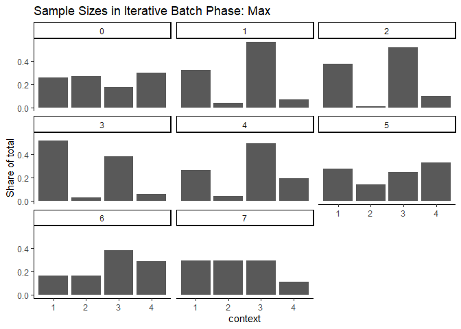
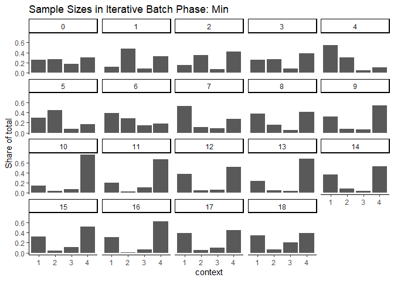
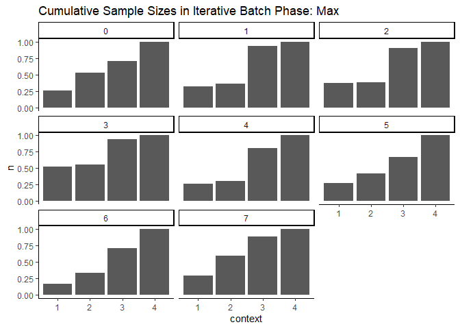
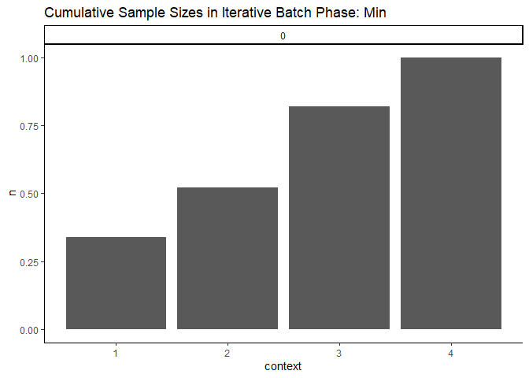
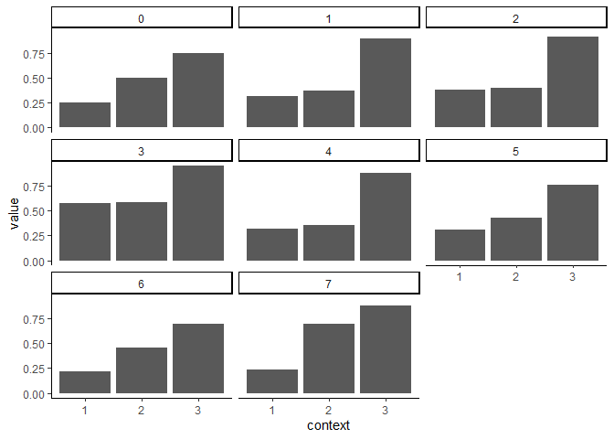
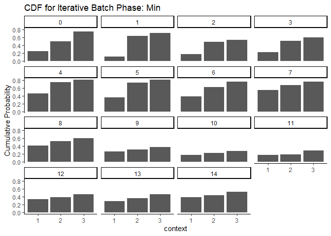
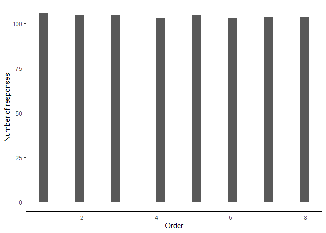
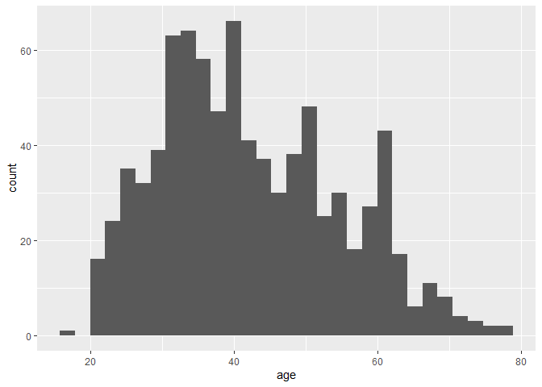

Process Qualtrics Data and Treatment Assignment Updating for Political
Candidates Survey
================
2023-11-07

# Setup Data Using Qualtrics API

- Load data directly from Qualtrics
- Can store API Key and credentials in `.renviron`

``` r
library(tidyverse)
library(qualtRics)
library(magrittr)
library(assertr)
library(RColorBrewer)

knitr::opts_chunk$set(cache.extra = 2023)

source("../_functions/data_cleaning.R")
config <- config::get()

# load log of probabilities
probabilities <- read_csv("../../02_output/probabilities_job_applicants.csv")
probabilities
```

    ## # A tibble: 27 × 4
    ##    Batch `Embedded data variable` CDF_Threshold `Batch Type`              
    ##    <dbl> <chr>                            <dbl> <chr>                     
    ##  1     0 pi1                              0.25  Warmup                    
    ##  2     0 pi2                              0.5   Warmup                    
    ##  3     0 pi3                              0.75  Warmup                    
    ##  4     1 pi1                              0.11  Iterative Batch Phase: Max
    ##  5     1 pi2                              0.639 Iterative Batch Phase: Max
    ##  6     1 pi3                              0.709 Iterative Batch Phase: Max
    ##  7     2 pi1                              0.378 Iterative Batch Phase: Max
    ##  8     2 pi2                              0.398 Iterative Batch Phase: Max
    ##  9     2 pi3                              0.91  Iterative Batch Phase: Max
    ## 10     3 pi1                              0.569 Iterative Batch Phase: Max
    ## # ℹ 17 more rows

``` r
url <- str_glue("https://{config$datacenter_id}.qualtrics.com")
survey_name <- "Job Applicants"

# can comment out after running once
# qualtrics_api_credentials(api_key = config$api_token,
#                           base_url = url,
#                           install = TRUE,
#                           overwrite=T)

df <- load_qualtrics(survey_name)
```

    ## Loading survey data for Job Applicants
    ##   |                                                                              |                                                                      |   0%  |                                                                              |=======                                                               |  10%  |                                                                              |=================================================                     |  70%  |                                                                              |======================================================================| 100%

    ## 
    ## ── Column specification ────────────────────────────────────────────────────────
    ## cols(
    ##   .default = col_character(),
    ##   StartDate = col_datetime(format = ""),
    ##   EndDate = col_datetime(format = ""),
    ##   Progress = col_double(),
    ##   `Duration (in seconds)` = col_double(),
    ##   Finished = col_logical(),
    ##   RecordedDate = col_datetime(format = ""),
    ##   QD2_1_TEXT = col_double(),
    ##   rnum = col_double(),
    ##   pi1 = col_double(),
    ##   pi2 = col_double(),
    ##   pi3 = col_double(),
    ##   rnum_mother = col_double(),
    ##   EmbeddedDataQuestions_DO_Q8 = col_double(),
    ##   EmbeddedDataQuestions_DO_Q7 = col_double(),
    ##   EmbeddedDataQuestions_DO_Q6 = col_double(),
    ##   EmbeddedDataQuestions_DO_Q5 = col_double(),
    ##   EmbeddedDataQuestions_DO_Q4 = col_double(),
    ##   EmbeddedDataQuestions_DO_Introduction = col_double(),
    ##   EmbeddedDataQuestions_DO_Q3 = col_double(),
    ##   EmbeddedDataQuestions_DO_Q2 = col_double()
    ##   # ... with 1 more columns
    ## )
    ## ℹ Use `spec()` for the full column specifications.

``` r
df %>%
  nrow()
```

    ## [1] 1007

``` r
# drop test data
df <- df %>%
  mutate(StartDate_clean = ymd_hms(StartDate)) %>%
  verify(is.na(StartDate_clean) == is.na(StartDate)) %>%
  filter(StartDate_clean >= ymd_hms("2024-02-25-18-00-00"))

df %>%
  nrow()
```

    ## [1] 886

``` r
# average finished rate
mean(df$Finished)
```

    ## [1] 1

``` r
# average time to complete
mean(df$`Duration (in seconds)`)
```

    ## [1] 241.3397

``` r
# compare amount of time spent
df %>%
  summarize(across(c(`Duration (in seconds)`),
    .fns = lst(
      mean = ~ mean(.) / 60,
      min = ~ min(.) / 60,
      max = ~ max(.) / 60,
      median = ~ median(.) / 60
    )
  ))
```

    ## # A tibble: 1 × 4
    ##   `Duration (in seconds)_mean` Duration (in seconds)_mi…¹ Duration (in seconds…²
    ##                          <dbl>                      <dbl>                  <dbl>
    ## 1                         4.02                        0.1                   41.2
    ## # ℹ abbreviated names: ¹​`Duration (in seconds)_min`,
    ## #   ²​`Duration (in seconds)_max`
    ## # ℹ 1 more variable: `Duration (in seconds)_median` <dbl>

## Create Batch ID variable

``` r
# hardcoding this because it should not be changing each time
# we should only update it as we increase batches

# check max date times on each day
df %>%
  mutate(date = date(StartDate_clean)) %>%
  group_by(date) %>%
  summarize(max_date_time = max(StartDate_clean))
```

    ## # A tibble: 2 × 2
    ##   date       max_date_time      
    ##   <date>     <dttm>             
    ## 1 2024-02-25 2024-02-25 23:30:35
    ## 2 2024-02-26 2024-02-26 22:31:00

``` r
df <- df %>%
  # drop data collected incorrectly
  mutate(
    batch_id = case_when(
      # NEED TO CHANGE
      StartDate_clean <= ymd_hms("2024-02-25-20-00-00") ~ 0,
      StartDate_clean <= ymd_hms("2024-02-26-00-00-00") ~ 1,
      StartDate_clean <= ymd_hms("2024-02-26-12-40-00") ~ 2,
      StartDate_clean <= ymd_hms("2024-02-26-13-30-00") ~ 3,
      StartDate_clean <= ymd_hms("2024-02-26-14-50-00") ~ 4,
      StartDate_clean <= ymd_hms("2024-02-26-18-50-00") ~ 5,
      StartDate_clean <= ymd_hms("2024-02-26-21-20-00") ~ 6,
      StartDate_clean <= ymd_hms("2024-02-26-22-35-00") ~ 7,
      TRUE ~ NA_integer_
    ),
    batch_type = case_when(
      batch_id == 0 ~ "Warmup",
      StartDate_clean <= ymd_hms("2024-02-26-22-35-00") ~ "Iterative Batch Phase: Max",
      TRUE ~ NA_character_
    )
  ) %>%
  verify(!is.na(batch_id)) %>%
  verify(!is.na(batch_type))

df %>%
  group_by(batch_type, batch_id) %>%
  summarize(n = n())
```

    ## `summarise()` has grouped output by 'batch_type'. You can override using the
    ## `.groups` argument.

    ## # A tibble: 8 × 3
    ## # Groups:   batch_type [2]
    ##   batch_type                 batch_id     n
    ##   <chr>                         <dbl> <int>
    ## 1 Iterative Batch Phase: Max        1   103
    ## 2 Iterative Batch Phase: Max        2   104
    ## 3 Iterative Batch Phase: Max        3   107
    ## 4 Iterative Batch Phase: Max        4   102
    ## 5 Iterative Batch Phase: Max        5    99
    ## 6 Iterative Batch Phase: Max        6   103
    ## 7 Iterative Batch Phase: Max        7   102
    ## 8 Warmup                            0   166

## Survey Validation

``` r
# check ID uniquely identifies rows in data
if (length(unique(df$`Prolific ID Q`)) != nrow(df)) {
  warning("ID is not unique")
}

if (!all(unique(df$Status) == "IP Address")) {
  warning("Test/spam data included in the analysis file")
  print(str_glue("Number of observations in data: {nrow(df)}"))
  print(str_glue("Status values in data: {str_c(unique(df$Status), collapse=', ')}"))
  df <- df %>%
    filter(Status == "IP Address")
  print(str_glue("Number of observations left in data: {nrow(df)}"))
}
```

``` r
# check embedded data variables match probabilities for all iterative batches
df %>%
  check_pi_vars(probabilities, 3)
```

    ## Warning in check_pi_vars(., probabilities, 3): Embedded data variables do not
    ## match probabilities in log

    ## # A tibble: 3 × 6
    ##   batch_id batch_type   Embedded data variab…¹ CDF_Data CDF_Threshold Comparison
    ##      <dbl> <chr>        <chr>                     <dbl>         <dbl> <lgl>     
    ## 1        1 Iterative B… pi1                       0.313         0.11  FALSE     
    ## 2        1 Iterative B… pi2                       0.367         0.639 FALSE     
    ## 3        1 Iterative B… pi3                       0.889         0.709 FALSE     
    ## # ℹ abbreviated name: ¹​`Embedded data variable`

``` r
# check distinct probabilities based on embedded data
df %>%
  select(batch_type, batch_id, str_c("pi", 1:3)) %>%
  distinct()
```

    ## # A tibble: 8 × 5
    ##   batch_type                 batch_id   pi1   pi2   pi3
    ##   <chr>                         <dbl> <dbl> <dbl> <dbl>
    ## 1 Warmup                            0 0.25  0.5   0.75 
    ## 2 Iterative Batch Phase: Max        1 0.313 0.367 0.889
    ## 3 Iterative Batch Phase: Max        2 0.378 0.398 0.91 
    ## 4 Iterative Batch Phase: Max        3 0.569 0.58  0.95 
    ## 5 Iterative Batch Phase: Max        4 0.314 0.358 0.877
    ## 6 Iterative Batch Phase: Max        5 0.31  0.429 0.753
    ## 7 Iterative Batch Phase: Max        6 0.214 0.453 0.696
    ## 8 Iterative Batch Phase: Max        7 0.237 0.696 0.873

``` r
# check consent means their responses are missing
df %>%
  filter(Consent == "I do not consent to participate") %>%
  select(Consent, `Duration (in seconds)`, Finished, batch_id, batch_type)
```

    ## # A tibble: 0 × 5
    ## # ℹ 5 variables: Consent <ord>, Duration (in seconds) <dbl>, Finished <lgl>,
    ## #   batch_id <dbl>, batch_type <chr>

``` r
df <- df %>%
  check_consent()
```

``` r
# check that all completed
df %>%
  filter(Finished != TRUE) %>%
  select(StartDate_clean, EndDate, `Duration (in seconds)`, Finished, Consent, PreScreen_Q1:QD5)
```

    ## # A tibble: 0 × 32
    ## # ℹ 32 variables: StartDate_clean <dttm>, EndDate <dttm>,
    ## #   Duration (in seconds) <dbl>, Finished <lgl>, Consent <ord>,
    ## #   PreScreen_Q1 <ord>, Prescreen_Q2 <ord>, Manipulation_Q2_TEXT <chr>,
    ## #   Commitment_Q1 <ord>, Commitment_Q2 <chr>, Q1 <ord>, Q2 <ord>, Q3 <ord>,
    ## #   Q4 <ord>, Q5 <ord>, Q6 <ord>, Q7 <ord>, Q8 <ord>, Manipulation_Q1_1 <chr>,
    ## #   Manipulation_Q1_2 <chr>, Manipulation_Q1_3 <chr>, QD2 <ord>,
    ## #   QD2_1_TEXT <dbl>, QD3_1 <chr>, QD3_2 <chr>, QD3_3 <chr>, QD3_4 <chr>, …

``` r
df <- df %>%
  check_completion()
```

``` r
df <- df %>%
  check_location_screen()

df <- df %>% 
  check_hiring_screen()
```

    ## Warning in check_hiring_screen(.): Dropping 48 survey respondents who have not
    ## been involved in hiring decisions

    ## Warning in check_hiring_screen(.): 48 survey respondents who have not been
    ## involved in hiring decisions

    ## # A tibble: 838 × 1
    ##    Manipulation_Q2_TEXT                                                         
    ##    <chr>                                                                        
    ##  1 To hire my replacement for a job and hire other people on my team            
    ##  2 Interviewed the candidates and went with the best fit. Has never been too ha…
    ##  3 I was part of the decision making process with a group of people. I met the …
    ##  4 I interviewed job candidates and gave feedback to the hiring committee.      
    ##  5 I make hiring decisions based on a criteria that my company provides me and …
    ##  6 as a hiring manager and as a teammate                                        
    ##  7 I have been the direct hiring manager for multiple staff members that work f…
    ##  8 I reviewed applications to recommend to my boss.                             
    ##  9 Helping interview candidates                                                 
    ## 10 Interviewed a candidate, discussed said candidate with fellow management, ma…
    ## # ℹ 828 more rows

    ## Warning in check_hiring_screen(.): 838 respondents in the data

``` r
# visually assessing why these respondents failed the commitment check
df %>%
  filter(Commitment_Q1 != "Yes, I will") %>%
  select(Commitment_Q1, Commitment_Q2, `Duration (in seconds)`, Finished, batch_id, batch_type)
```

    ## # A tibble: 0 × 6
    ## # ℹ 6 variables: Commitment_Q1 <ord>, Commitment_Q2 <chr>,
    ## #   Duration (in seconds) <dbl>, Finished <lgl>, batch_id <dbl>,
    ## #   batch_type <chr>

``` r
df %>%
  filter(str_to_lower(Commitment_Q2) != "purple") %>%
  select(Commitment_Q1, Commitment_Q2, `Duration (in seconds)`, Finished, batch_id, batch_type)
```

    ## # A tibble: 3 × 6
    ##   Commitment_Q1 Commitment_Q2 `Duration (in seconds)` Finished batch_id
    ##   <ord>         <chr>                           <dbl> <lgl>       <dbl>
    ## 1 Yes, I will   puple                             183 TRUE            0
    ## 2 Yes, I will   pueple                            213 TRUE            1
    ## 3 Yes, I will   purples                           117 TRUE            5
    ## # ℹ 1 more variable: batch_type <chr>

``` r
df <- df %>%
  check_commitment()
```

    ## Warning in check_commitment(.): Dropping 3 survey respondents who did not pass
    ## commitment check 2

    ## Warning in check_commitment(.): 835 respondents in the data

``` r
# check ID is unique again
if (length(unique(df$`Prolific ID Q`)) != nrow(df)) {
  warning("ID is not unique")
  print(str_glue("Number of rows in data: {nrow(df)}"))
  df <- df %>%
    group_by(`Prolific ID Q`) %>%
    arrange(`Prolific ID Q`, StartDate_clean) %>%
    mutate(flag_first_obs = if_else(row_number() == 1, 1, 0)) %>%
    ungroup()

  df %>%
    group_by(`Prolific ID Q`) %>%
    mutate(n = n()) %>%
    arrange(desc(n), StartDate_clean) %>%
    ungroup() %>%
    select(n, StartDate_clean, EndDate, flag_first_obs, `Duration (in seconds)`, Finished, batch_id, batch_type) %>%
    print()

  df <- df %>%
    filter(flag_first_obs == 1)

  print(str_glue("Number of rows in data after dropping duplicate ID: {nrow(df)}"))
}

stopifnot(length(unique(df$`Prolific ID Q`)) == nrow(df))
```

## Create Context and Context Label Variables

``` r
# create context variable
df <- df %>%
  mutate(across(str_c("Q", 1:8), .fns = lst(orig = ~.))) %>% 
  create_context_var_jobs() %>%
  verify(!is.na(context))   %>%
  verify(!is.na(context_label))

df %>%
  group_by(batch_type, context, context_label) %>%
  summarize(n = n())
```

    ## `summarise()` has grouped output by 'batch_type', 'context'. You can override
    ## using the `.groups` argument.

    ## # A tibble: 8 × 4
    ## # Groups:   batch_type, context [8]
    ##   batch_type                 context context_label     n
    ##   <chr>                      <ord>   <chr>         <int>
    ## 1 Iterative Batch Phase: Max 1       black_low       216
    ## 2 Iterative Batch Phase: Max 2       black_high       71
    ## 3 Iterative Batch Phase: Max 3       white_low       281
    ## 4 Iterative Batch Phase: Max 4       white_high      113
    ## 5 Warmup                     1       black_low        40
    ## 6 Warmup                     2       black_high       41
    ## 7 Warmup                     3       white_low        27
    ## 8 Warmup                     4       white_high       46

``` r
df %>%
  group_by(batch_type, batch_id) %>%
  summarize(n = n())
```

    ## `summarise()` has grouped output by 'batch_type'. You can override using the
    ## `.groups` argument.

    ## # A tibble: 8 × 3
    ## # Groups:   batch_type [2]
    ##   batch_type                 batch_id     n
    ##   <chr>                         <dbl> <int>
    ## 1 Iterative Batch Phase: Max        1    99
    ## 2 Iterative Batch Phase: Max        2    99
    ## 3 Iterative Batch Phase: Max        3    94
    ## 4 Iterative Batch Phase: Max        4    97
    ## 5 Iterative Batch Phase: Max        5    97
    ## 6 Iterative Batch Phase: Max        6    97
    ## 7 Iterative Batch Phase: Max        7    98
    ## 8 Warmup                            0   154

``` r
df %>%
  group_by(context, batch_type, batch_id) %>%
  filter(batch_type %in% c("Warmup", "Iterative Batch Phase: Max")) %>%
  summarize(n = n()) %>%
  group_by(batch_type, batch_id) %>%
  mutate(n = n / sum(n)) %>%
  ggplot(aes(context, n)) +
  geom_col() +
  theme_classic() +
  facet_wrap(~batch_id) +
  labs(
    title = "Sample Sizes in Iterative Batch Phase: Max",
    y = "Share of total"
  )
```

    ## `summarise()` has grouped output by 'context', 'batch_type'. You can override
    ## using the `.groups` argument.

<!-- -->

``` r
df %>%
  group_by(context, batch_type, batch_id) %>%
  filter(batch_type %in% c("Warmup", "Iterative Batch Phase: Min")) %>%
  summarize(n = n()) %>%
  group_by(batch_type, batch_id) %>%
  mutate(n = n / sum(n)) %>%
  ggplot(aes(context, n)) +
  geom_col() +
  theme_classic() +
  facet_wrap(~batch_id) +
  labs(
    title = "Sample Sizes in Iterative Batch Phase: Min",
    y = "Share of total"
  )
```

    ## `summarise()` has grouped output by 'context', 'batch_type'. You can override
    ## using the `.groups` argument.

<!-- -->

``` r
df %>%
  group_by(context, batch_type, batch_id) %>%
  filter(batch_type %in% c("Warmup", "Iterative Batch Phase: Max")) %>%
  summarize(n = n()) %>%
  group_by(batch_id, batch_type) %>%
  arrange(context) %>%
  mutate(n = cumsum(n) / sum(n)) %>%
  ggplot(aes(context, n)) +
  geom_col() +
  theme_classic() +
  facet_wrap(~batch_id) +
  labs(title = "Cumulative Sample Sizes in Iterative Batch Phase: Max")
```

    ## `summarise()` has grouped output by 'context', 'batch_type'. You can override
    ## using the `.groups` argument.

<!-- -->

``` r
df %>%
  group_by(context, batch_type, batch_id) %>%
  filter(batch_type %in% c("Warmup", "Iterative Batch Phase: Min")) %>%
  summarize(n = n()) %>%
  group_by(batch_id, batch_type) %>%
  arrange(context) %>%
  mutate(n = cumsum(n) / sum(n)) %>%
  ggplot(aes(context, n)) +
  geom_col() +
  theme_classic() +
  facet_wrap(~batch_id) +
  labs(title = "Cumulative Sample Sizes in Iterative Batch Phase: Min")
```

    ## `summarise()` has grouped output by 'context', 'batch_type'. You can override
    ## using the `.groups` argument.

<!-- -->

``` r
df %>%
  filter(batch_type %in% c("Warmup", "Iterative Batch Phase: Max")) %>%
  group_by(batch_id, batch_type) %>%
  select(str_c("pi", 1:3)) %>%
  distinct() %>%
  pivot_longer(-c(batch_id, batch_type)) %>%
  mutate(context = str_replace_all(name, "pi", "")) %>%
  ggplot(aes(context, value)) +
  geom_col() +
  theme_classic() +
  facet_wrap(~batch_id)
```

    ## Adding missing grouping variables: `batch_id`, `batch_type`

<!-- -->

``` r
df %>%
  filter(batch_type %in% c("Warmup", "Iterative Batch Phase: Min")) %>%
  group_by(batch_id, batch_type) %>%
  select(str_c("pi", 1:3)) %>%
  distinct() %>%
  pivot_longer(-c(batch_id, batch_type)) %>%
  mutate(context = str_replace_all(name, "pi", "")) %>%
  ggplot(aes(context, value)) +
  geom_col() +
  theme_classic() +
  facet_wrap(~batch_id) +
  labs(
    title = "CDF for Iterative Batch Phase: Min",
    y = "Cumulative Probability"
  )
```

    ## Adding missing grouping variables: `batch_id`, `batch_type`

<!-- -->

``` r
# check randomness of question ordering
# plot counts by question order
df %>% 
  select(str_c("Q", 1:8)) %>% 
  pivot_longer(everything()) %>%
  filter(value == 'Candidate 1' | value == 'Candidate 2') %>% 
  mutate(order_val = as.numeric(str_replace_all(name, "Q", ""))) %>% 
  ggplot() +
  geom_histogram(aes(order_val)) +
  theme_classic() +
  labs(x = 'Order', y = 'Number of responses')
```

    ## `stat_bin()` using `bins = 30`. Pick better value with `binwidth`.

<!-- -->

## Clean Qualtrics Data

``` r
df_clean <- create_outcome_var_jobs(df)

# each question number is the random ordering of the context attributes
df_clean %>%
  select(chose_mother, str_c("Q", 1:8), context) %>%
  verify(!is.na(chose_mother))
```

    ## # A tibble: 835 × 10
    ##    chose_mother    Q1    Q2    Q3    Q4    Q5    Q6    Q7    Q8 context
    ##           <dbl> <dbl> <dbl> <dbl> <dbl> <dbl> <dbl> <dbl> <dbl> <ord>  
    ##  1            0     0    NA    NA    NA    NA    NA    NA    NA 3      
    ##  2            0    NA    NA    NA    NA    NA    NA     0    NA 4      
    ##  3            0    NA    NA    NA    NA     0    NA    NA    NA 3      
    ##  4            0    NA    NA    NA    NA     0    NA    NA    NA 2      
    ##  5            0    NA    NA    NA    NA    NA    NA     0    NA 2      
    ##  6            0    NA     0    NA    NA    NA    NA    NA    NA 4      
    ##  7            0     0    NA    NA    NA    NA    NA    NA    NA 4      
    ##  8            1    NA    NA    NA    NA     1    NA    NA    NA 4      
    ##  9            0    NA    NA    NA    NA    NA    NA    NA     0 2      
    ## 10            0    NA    NA    NA    NA    NA     0    NA    NA 3      
    ## # ℹ 825 more rows

``` r
df_clean %>%
  group_by(context, context_label) %>%
  summarize(
    n = n(),
    chose_mother_total = sum(chose_mother),
    chose_nonmother_total = sum(chose_mother == 0)
  ) %>% 
  mutate(diff = abs(chose_mother_total - chose_nonmother_total))
```

    ## `summarise()` has grouped output by 'context'. You can override using the
    ## `.groups` argument.

    ## # A tibble: 4 × 6
    ## # Groups:   context [4]
    ##   context context_label     n chose_mother_total chose_nonmother_total  diff
    ##   <ord>   <chr>         <int>              <dbl>                 <int> <dbl>
    ## 1 1       black_low       256                125                   131     6
    ## 2 2       black_high      112                 58                    54     4
    ## 3 3       white_low       308                149                   159    10
    ## 4 4       white_high      159                 70                    89    19

``` r
df_clean %>%
  group_by(batch_id, batch_type, context, context_label) %>%
  summarize(
    n = n(),
    chose_mother_total = sum(chose_mother),
    chose_nonmother_total = sum(chose_mother == 0)
  ) %>% 
  mutate(diff = abs(chose_mother_total - chose_nonmother_total))
```

    ## `summarise()` has grouped output by 'batch_id', 'batch_type', 'context'. You
    ## can override using the `.groups` argument.

    ## # A tibble: 32 × 8
    ## # Groups:   batch_id, batch_type, context [32]
    ##    batch_id batch_type            context context_label     n chose_mother_total
    ##       <dbl> <chr>                 <ord>   <chr>         <int>              <dbl>
    ##  1        0 Warmup                1       black_low        40                 19
    ##  2        0 Warmup                2       black_high       41                 15
    ##  3        0 Warmup                3       white_low        27                 14
    ##  4        0 Warmup                4       white_high       46                 19
    ##  5        1 Iterative Batch Phas… 1       black_low        32                 18
    ##  6        1 Iterative Batch Phas… 2       black_high        4                  1
    ##  7        1 Iterative Batch Phas… 3       white_low        56                 30
    ##  8        1 Iterative Batch Phas… 4       white_high        7                  4
    ##  9        2 Iterative Batch Phas… 1       black_low        37                 22
    ## 10        2 Iterative Batch Phas… 2       black_high        1                  0
    ## # ℹ 22 more rows
    ## # ℹ 2 more variables: chose_nonmother_total <int>, diff <dbl>

``` r
# identify context desc
df_clean %>%
  select(context, context_label, starts_with("name"), starts_with("education")) %>%
  distinct() %>%
  arrange(context)
```

    ## # A tibble: 4 × 8
    ##   context context_label name1          name2  name_short1 name_short2 education1
    ##   <ord>   <chr>         <chr>          <chr>  <chr>       <chr>       <chr>     
    ## 1 1       black_low     Tanisha Rivers Keish… Tanisha     Keisha      B.S. in B…
    ## 2 2       black_high    Tanisha Rivers Keish… Tanisha     Keisha      B.S. in B…
    ## 3 3       white_low     Laurie Schmitt Allis… Laurie      Allison     B.S. in B…
    ## 4 4       white_high    Laurie Schmitt Allis… Laurie      Allison     B.S. in B…
    ## # ℹ 1 more variable: education2 <chr>

``` r
# check manipulation questions
df_attention_check <- df_clean %>%
  mutate(
    candidate_mother = if_else(rnum_mother <= 0.5, "Candidate 2", "Candidate 1"),
    manipulation_check_missing = rowSums(select(., starts_with("Manipulation_Q1_")) %>%
      is.na())
  ) %>%
  mutate(pass_attention_check = case_when(
    (rnum_mother <= 0.5) &
      (Manipulation_Q1_2 == "Candidate 2") &
      # only when they've selected one response, i.e. missing = 2
      (manipulation_check_missing == 2) ~ 1,
    (rnum_mother > 0.5) &
      (Manipulation_Q1_1 == "Candidate 1") &
      # only when they've selected one response, i.e. missing = 2
      (manipulation_check_missing == 2) ~ 1,
    TRUE ~ 0),
    pass_attention_check_any = case_when(
    (rnum_mother <= 0.5) &
      (Manipulation_Q1_2 == "Candidate 2") ~ 1,
    (rnum_mother > 0.5) &
      (Manipulation_Q1_1 == "Candidate 1") ~ 1,
    TRUE ~ 0),
  unsure_attention_check = if_else(Manipulation_Q1_3 == "Not sure" & !is.na(Manipulation_Q1_3), 1, 0))

df_attention_check %>%
  summarize(per_pass_attention_check = mean(pass_attention_check),
            per_pass_attention_check_any = mean(pass_attention_check_any),
            per_unsure = mean(unsure_attention_check))
```

    ## # A tibble: 1 × 3
    ##   per_pass_attention_check per_pass_attention_check_any per_unsure
    ##                      <dbl>                        <dbl>      <dbl>
    ## 1                    0.692                        0.741      0.238

``` r
df_attention_check %>%
  group_by(batch_id, batch_type) %>% 
  summarize(per_pass_attention_check = mean(pass_attention_check),
            per_pass_attention_check_any = mean(pass_attention_check_any),
            per_unsure = mean(unsure_attention_check))
```

    ## `summarise()` has grouped output by 'batch_id'. You can override using the
    ## `.groups` argument.

    ## # A tibble: 8 × 5
    ## # Groups:   batch_id [8]
    ##   batch_id batch_type   per_pass_attention_c…¹ per_pass_attention_c…² per_unsure
    ##      <dbl> <chr>                         <dbl>                  <dbl>      <dbl>
    ## 1        0 Warmup                        0.662                  0.727      0.260
    ## 2        1 Iterative B…                  0.646                  0.717      0.293
    ## 3        2 Iterative B…                  0.727                  0.758      0.222
    ## 4        3 Iterative B…                  0.638                  0.713      0.277
    ## 5        4 Iterative B…                  0.742                  0.763      0.216
    ## 6        5 Iterative B…                  0.742                  0.773      0.186
    ## 7        6 Iterative B…                  0.711                  0.773      0.227
    ## 8        7 Iterative B…                  0.684                  0.714      0.214
    ## # ℹ abbreviated names: ¹​per_pass_attention_check, ²​per_pass_attention_check_any

``` r
df_attention_check %>% 
  mutate(candidate_mother = if_else(rnum_mother <= 0.5, "Candidate 2", "Candidate 1")) %>% 
  select(rnum_mother, candidate_mother, pass_attention_check, chose_mother, str_c("Q", 1:8, "_orig"),
         starts_with("volunteer"), starts_with("Manipulation_Q1_"))
```

    ## # A tibble: 835 × 17
    ##    rnum_mother candidate_mother pass_attention_check chose_mother Q1_orig    
    ##          <dbl> <chr>                           <dbl>        <dbl> <ord>      
    ##  1      0.782  Candidate 1                         1            0 Candidate 2
    ##  2      0.501  Candidate 1                         1            0 <NA>       
    ##  3      0.0982 Candidate 2                         0            0 <NA>       
    ##  4      0.0183 Candidate 2                         0            0 <NA>       
    ##  5      0.437  Candidate 2                         1            0 <NA>       
    ##  6      0.259  Candidate 2                         1            0 <NA>       
    ##  7      0.662  Candidate 1                         0            0 Candidate 2
    ##  8      0.387  Candidate 2                         0            1 <NA>       
    ##  9      0.0362 Candidate 2                         0            0 <NA>       
    ## 10      0.515  Candidate 1                         0            0 <NA>       
    ## # ℹ 825 more rows
    ## # ℹ 12 more variables: Q2_orig <ord>, Q3_orig <ord>, Q4_orig <ord>,
    ## #   Q5_orig <ord>, Q6_orig <ord>, Q7_orig <ord>, Q8_orig <ord>,
    ## #   volunteer1 <chr>, volunteer2 <chr>, Manipulation_Q1_1 <chr>,
    ## #   Manipulation_Q1_2 <chr>, Manipulation_Q1_3 <chr>

``` r
df_attention_check %>% 
  mutate(candidate_mother = if_else(rnum_mother <= 0.5, "Candidate 2", "Candidate 1")) %>% 
  select(rnum_mother, candidate_mother, pass_attention_check, chose_mother, starts_with("Manipulation_Q1_"),
         manipulation_check_missing, starts_with("volunteer"))
```

    ## # A tibble: 835 × 10
    ##    rnum_mother candidate_mother pass_attention_check chose_mother
    ##          <dbl> <chr>                           <dbl>        <dbl>
    ##  1      0.782  Candidate 1                         1            0
    ##  2      0.501  Candidate 1                         1            0
    ##  3      0.0982 Candidate 2                         0            0
    ##  4      0.0183 Candidate 2                         0            0
    ##  5      0.437  Candidate 2                         1            0
    ##  6      0.259  Candidate 2                         1            0
    ##  7      0.662  Candidate 1                         0            0
    ##  8      0.387  Candidate 2                         0            1
    ##  9      0.0362 Candidate 2                         0            0
    ## 10      0.515  Candidate 1                         0            0
    ## # ℹ 825 more rows
    ## # ℹ 6 more variables: Manipulation_Q1_1 <chr>, Manipulation_Q1_2 <chr>,
    ## #   Manipulation_Q1_3 <chr>, manipulation_check_missing <dbl>,
    ## #   volunteer1 <chr>, volunteer2 <chr>

``` r
df_clean <- df_clean %>%
  verify(is.numeric(QD2_1_TEXT)) %>%
  rename(age = QD2_1_TEXT) %>%
  mutate(
    hispanic = if_else(QD4 == "Yes", TRUE, FALSE),
    female = if_else(QD5 == "Female", TRUE, FALSE)
  ) %>%
  mutate(across(starts_with("QD3_"), .fns = lst(race_num = ~ if_else(!is.na(.), 1, 0)))) %>%
  mutate(
    race_count = rowSums(select(., ends_with("race_num"))),
    race = case_when(
      race_count > 1 ~ "Multiracial",
      !is.na(QD3_1) ~ "American Indian or Alaskan Native",
      !is.na(QD3_2) ~ "Asian",
      !is.na(QD3_3) ~ "Black or African American",
      !is.na(QD3_4) ~ "Native Hawaiian",
      !is.na(QD3_5) ~ "White",
      !is.na(QD3_6) ~ "Other",
      !is.na(QD3_7) ~ "Prefer not to disclose"
    )
  ) %>%
  verify(!is.na(race))

df_clean %>%
  group_by(race) %>%
  summarize(n = n()) %>%
  ungroup() %>%
  mutate(per = n / sum(n)) %>%
  arrange(desc(per))
```

    ## # A tibble: 8 × 3
    ##   race                                  n     per
    ##   <chr>                             <int>   <dbl>
    ## 1 White                               589 0.705  
    ## 2 Black or African American           116 0.139  
    ## 3 Asian                                73 0.0874 
    ## 4 Multiracial                          39 0.0467 
    ## 5 Other                                 9 0.0108 
    ## 6 American Indian or Alaskan Native     6 0.00719
    ## 7 Prefer not to disclose                2 0.00240
    ## 8 Native Hawaiian                       1 0.00120

``` r
df_clean %>%
  ggplot(aes(age)) +
  geom_histogram()
```

    ## `stat_bin()` using `bins = 30`. Pick better value with `binwidth`.

<!-- -->

``` r
df_clean %>%
  group_by(female) %>%
  summarize(count = n())
```

    ## # A tibble: 2 × 2
    ##   female count
    ##   <lgl>  <int>
    ## 1 FALSE    416
    ## 2 TRUE     419

``` r
df_clean %>%
  summarize(
    count_hispanic = sum(hispanic),
    per_hispanic = mean(hispanic)
  )
```

    ## # A tibble: 1 × 2
    ##   count_hispanic per_hispanic
    ##            <int>        <dbl>
    ## 1             67       0.0802

## Clean Data Validation

``` r
# check every respondent has exactly one non-missing value
check_allmissing <- df_clean %>%
  select(str_c("Q", 1:8)) %>%
  mutate(across(everything(), ~ as.character(.))) %>%
  is.na() %>%
  rowSums(na.rm = T) %>%
  equals(8) %>%
  any()

if (check_allmissing == TRUE) {
  warning("Some rows are missing outcome responses\n")
}

# check row total is not more than 1
# 0 if selected the older candidate
check_rowtotal <- df_clean %>%
  select(str_c("Q", 1:8)) %>%
  rowSums(na.rm = T) %>%
  is_weakly_less_than(1) %>%
  all()

if (check_rowtotal == FALSE) {
  warning("Total of outcome responses is more than 1\n")
}
```

``` r
# create ID with a random ordering
df_clean <- df_clean %>%
  mutate(rand_sort = runif(nrow(df_clean))) %>%
  arrange(batch_id, rand_sort) %>%
  mutate(unique_id = row_number()) %>%
  select(-rand_sort)
```

``` r
df_clean %>%
  select(unique_id, context, context_label, batch_id, batch_type, chose_mother, race, age, female, hispanic) %>%
  saveRDS("../../02_output/job_applicants_data_clean.RDS")

df_clean %>%
  select(unique_id, context, context_label, batch_id, batch_type, chose_mother, race, age, female, hispanic) %>%
  write_csv("../../02_output/job_applicants_data_clean.csv")
```
