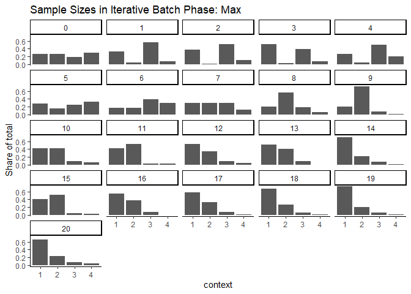
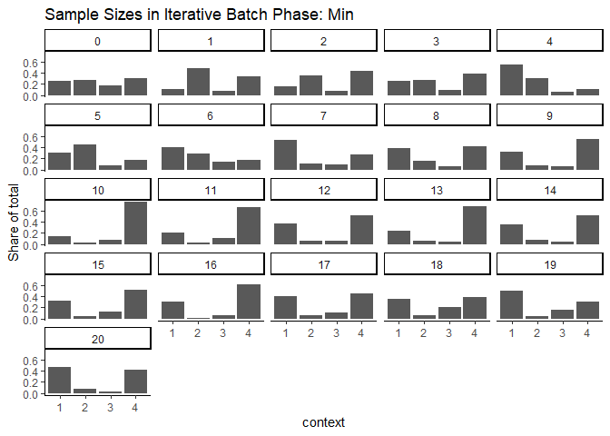
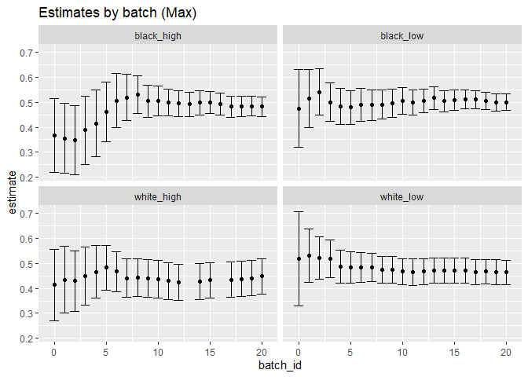
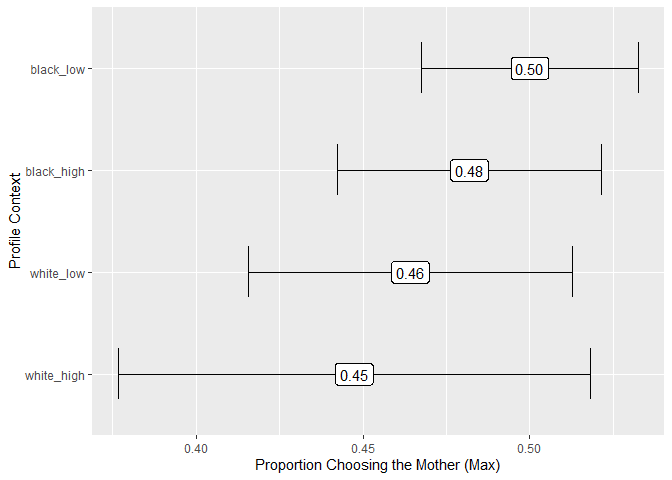
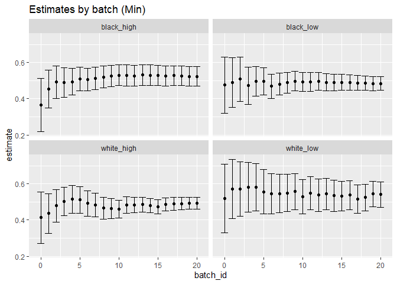
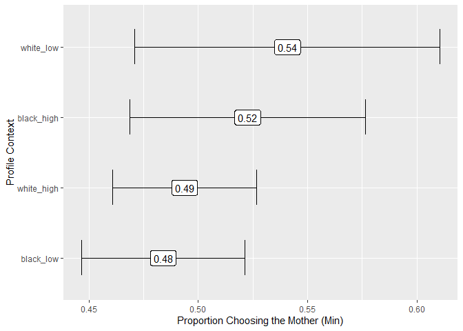

Analysis: Job Applicants Survey Experiment
================
2023-11-07

``` r
library(tidyverse)

data <- readRDS("../../02_output/job_applicants_data_clean.RDS") %>% 
  mutate(batch_type = factor(batch_type, levels = c("Warmup", "Iterative Batch Phase: Max",
                                                    "Iterative Batch Phase: Min"), ordered=TRUE))
```

``` r
# look at empirical proportions over time and by batch
data %>%
  group_by(context, batch_type, batch_id) %>%
  filter(batch_type %in% c("Warmup", "Iterative Batch Phase: Max")) %>%
  summarize(n = n()) %>%
  group_by(batch_type, batch_id) %>%
  mutate(n = n / sum(n)) %>%
  ggplot(aes(context, n)) +
  geom_col() +
  theme_classic() +
  facet_wrap(~batch_id) +
  labs(
    title = "Sample Sizes in Iterative Batch Phase: Max",
    y = "Share of total"
  )
```

<!-- -->

``` r
data %>%
  group_by(context, batch_type, batch_id) %>%
  filter(batch_type %in% c("Warmup", "Iterative Batch Phase: Min")) %>%
  summarize(n = n()) %>%
  group_by(batch_type, batch_id) %>%
  mutate(n = n / sum(n)) %>%
  ggplot(aes(context, n)) +
  geom_col() +
  theme_classic() +
  facet_wrap(~batch_id) +
  labs(
    title = "Sample Sizes in Iterative Batch Phase: Min",
    y = "Share of total"
  )
```

<!-- -->

``` r
data %>%
  group_by(batch_type, context, context_label) %>%
  summarize(n = n()) %>%
  arrange(batch_type, desc(n))
```

    ## `summarise()` has grouped output by 'batch_type', 'context'. You can override
    ## using the `.groups` argument.

    ## # A tibble: 12 × 4
    ## # Groups:   batch_type, context [12]
    ##    batch_type                 context context_label     n
    ##    <ord>                      <ord>   <chr>         <int>
    ##  1 Warmup                     4       white_high       46
    ##  2 Warmup                     2       black_high       41
    ##  3 Warmup                     1       black_low        40
    ##  4 Warmup                     3       white_low        27
    ##  5 Iterative Batch Phase: Max 1       black_low       862
    ##  6 Iterative Batch Phase: Max 2       black_high      567
    ##  7 Iterative Batch Phase: Max 3       white_low       378
    ##  8 Iterative Batch Phase: Max 4       white_high      144
    ##  9 Iterative Batch Phase: Min 4       white_high      841
    ## 10 Iterative Batch Phase: Min 1       black_low       648
    ## 11 Iterative Batch Phase: Min 2       black_high      290
    ## 12 Iterative Batch Phase: Min 3       white_low       169

``` r
# Create an aggregated dataset with the estimate using all data up to the end
# of each batch.
aggregated_max <- data %>%
  filter(batch_type %in% c('Warmup', 'Iterative Batch Phase: Max')) %>% 
  arrange(context_label, batch_id) %>%
  group_by(context_label) %>%
  mutate(
    index = 1:n(),
    # Make the estimate using all observations up to this point:
    # cumulative sum of choosing younger
    # divided by number of observations
    estimate = cumsum(chose_mother) / index,
    se = sqrt(estimate * (1 - estimate) / index),
    ci.min = estimate - qnorm(.975) * se,
    ci.max = estimate + qnorm(.975) * se
  ) %>%
  group_by(context_label, batch_id) %>%
  filter(index == max(index))

aggregated_max
```

    ## # A tibble: 82 × 15
    ## # Groups:   context_label, batch_id [82]
    ##    unique_id context context_label batch_id batch_type  chose_mother race    age
    ##        <int> <ord>   <chr>            <dbl> <ord>              <dbl> <chr> <dbl>
    ##  1       153 2       black_high           0 Warmup                 1 White    63
    ##  2       343 2       black_high           1 Iterative …            0 White    54
    ##  3       372 2       black_high           2 Iterative …            0 White    62
    ##  4       627 2       black_high           3 Iterative …            1 White    56
    ##  5       856 2       black_high           4 Iterative …            0 Blac…    33
    ##  6      1113 2       black_high           5 Iterative …            0 White    43
    ##  7      1298 2       black_high           6 Iterative …            1 Blac…    46
    ##  8      1492 2       black_high           7 Iterative …            1 White    47
    ##  9      1697 2       black_high           8 Iterative …            1 White    36
    ## 10      1890 2       black_high           9 Iterative …            1 Asian    25
    ## # ℹ 72 more rows
    ## # ℹ 7 more variables: female <lgl>, hispanic <lgl>, index <int>,
    ## #   estimate <dbl>, se <dbl>, ci.min <dbl>, ci.max <dbl>

``` r
# Visualize the estimates by the end of each batch
aggregated_max %>%
  ggplot(aes(
    x = batch_id, y = estimate,
    ymin = ci.min, ymax = ci.max
  )) +
  geom_point() +
  geom_errorbar() +
  facet_wrap(~context_label) +
  scale_x_continuous(
    breaks = c(0,5,10,15,20),
    labels = c(0,5,10,15,20)
  ) +
  labs(title = 'Estimates by batch (Max)')
```

<!-- -->

``` r
ggsave("../02_output/_figures/all_data_estimates_job_applicants.png",
  height = 5, width = 5, dpi = 300
)

# Visualize estimates using all data
aggregated_max %>%
  ungroup() %>%
  filter(batch_id == max(batch_id)) %>%
  mutate(context_label = fct_reorder(context_label, estimate)) %>%
  ggplot(aes(
    y = context_label, x = estimate,
    xmin = ci.min, xmax = ci.max
  )) +
  # geom_vline(xintercept = 1, linetype = "dashed") +
  geom_errorbar(width = .5) +
  geom_label(aes(label = format(round(estimate, 2), nsmall = 2))) +
  xlab("Proportion Choosing the Mother (Max)") +
  ylab("Profile Context")
```

<!-- -->

``` r
ggsave("../02_output/_figures/all_data_estimates_job_applicants.png",
  height = 3, width = 4, dpi = 300
)
```

``` r
# Create an aggregated dataset with the estimate using all data up to the end
# of each batch.
aggregated_min <- data %>%
  filter(batch_type %in% c('Warmup', 'Iterative Batch Phase: Min')) %>% 
  arrange(context_label, batch_id) %>%
  group_by(context_label) %>%
  mutate(
    index = 1:n(),
    # Make the estimate using all observations up to this point:
    # cumulative sum of choosing younger
    # divided by number of observations
    estimate = cumsum(chose_mother) / index,
    se = sqrt(estimate * (1 - estimate) / index),
    ci.min = estimate - qnorm(.975) * se,
    ci.max = estimate + qnorm(.975) * se
  ) %>%
  group_by(context_label, batch_id) %>%
  filter(index == max(index))

aggregated_min
```

    ## # A tibble: 84 × 15
    ## # Groups:   context_label, batch_id [84]
    ##    unique_id context context_label batch_id batch_type  chose_mother race    age
    ##        <int> <ord>   <chr>            <dbl> <ord>              <dbl> <chr> <dbl>
    ##  1       153 2       black_high           0 Warmup                 1 White    63
    ##  2       347 2       black_high           1 Iterative …            1 White    73
    ##  3       534 2       black_high           2 Iterative …            1 White    64
    ##  4       717 2       black_high           3 Iterative …            0 White    30
    ##  5       916 2       black_high           4 Iterative …            0 White    28
    ##  6      1115 2       black_high           5 Iterative …            1 Mult…    27
    ##  7      1307 2       black_high           6 Iterative …            0 Mult…    35
    ##  8      1494 2       black_high           7 Iterative …            1 White    40
    ##  9      1695 2       black_high           8 Iterative …            1 White    46
    ## 10      1863 2       black_high           9 Iterative …            1 White    28
    ## # ℹ 74 more rows
    ## # ℹ 7 more variables: female <lgl>, hispanic <lgl>, index <int>,
    ## #   estimate <dbl>, se <dbl>, ci.min <dbl>, ci.max <dbl>

``` r
# Visualize the estimates by the end of each batch
aggregated_min %>%
  ggplot(aes(
    x = batch_id, y = estimate,
    ymin = ci.min, ymax = ci.max
  )) +
  geom_point() +
  geom_errorbar() +
  facet_wrap(~context_label) +
  scale_x_continuous(
    breaks = c(0,5,10,15,20),
    labels = c(0,5,10,15,20)
  ) +
  labs(title = 'Estimates by batch (Min)')
```

<!-- -->

``` r
ggsave("../02_output/_figures/all_data_estimates_job_applicants_min.png",
  height = 5, width = 5, dpi = 300
)

# Visualize estimates using all data
aggregated_min %>%
  ungroup() %>%
  filter(batch_id == max(batch_id)) %>%
  mutate(context_label = fct_reorder(context_label, estimate)) %>%
  ggplot(aes(
    y = context_label, x = estimate,
    xmin = ci.min, xmax = ci.max
  )) +
  # geom_vline(xintercept = 1, linetype = "dashed") +
  geom_errorbar(width = .5) +
  geom_label(aes(label = format(round(estimate, 2), nsmall = 2))) +
  xlab("Proportion Choosing the Mother (Min)") +
  ylab("Profile Context")
```

<!-- -->

``` r
ggsave("../02_output/_figures/all_data_estimates_job_applicants_min.png",
  height = 3, width = 4, dpi = 300
)
```
