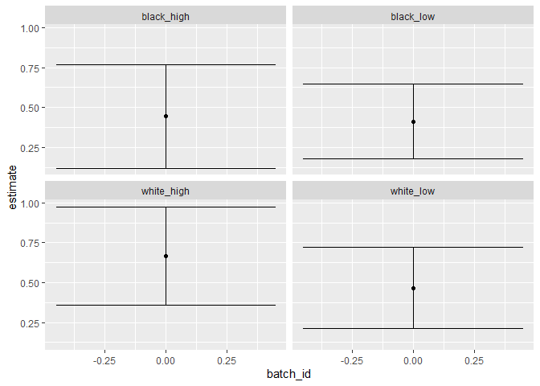
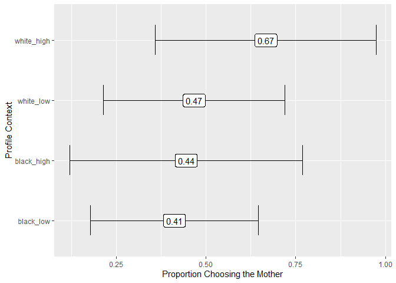

Process Qualtrics Data and Treatment Assignment Updating for Political
Candidates Survey
================
2023-11-07

# Setup Data Using Qualtrics API

- Load data directly from Qualtrics
- Can store API Key and credentials in `.renviron`

``` r
library(tidyverse)

data <- readRDS("../../02_output/job_applicants_data_clean.RDS") %>%
  filter(batch_type != "Iterative Batch Phase: Max")
```

``` r
data %>%
  group_by(context, context_label) %>%
  summarize(n = n())
```

    ## `summarise()` has grouped output by 'context'. You can override using the
    ## `.groups` argument.

    ## # A tibble: 4 × 3
    ## # Groups:   context [4]
    ##   context context_label     n
    ##   <ord>   <chr>         <int>
    ## 1 1       black_low        17
    ## 2 2       black_high        9
    ## 3 3       white_low        15
    ## 4 4       white_high        9

``` r
# Create an aggregated dataset with the estimate using all data up to the end
# of each batch.
aggregated <- data %>%
  arrange(context_label, batch_id) %>%
  group_by(context_label) %>%
  mutate(
    index = 1:n(),
    # Make the estimate using all observations up to this point:
    # cumulative sum of choosing younger
    # divided by number of observations
    estimate = cumsum(chose_mother) / index,
    se = sqrt(estimate * (1 - estimate) / index),
    ci.min = estimate - qnorm(.975) * se,
    ci.max = estimate + qnorm(.975) * se
  ) %>%
  group_by(context_label, batch_id) %>%
  filter(index == max(index))

aggregated
```

    ## # A tibble: 4 × 15
    ## # Groups:   context_label, batch_id [4]
    ##   unique_id context context_label batch_id batch_type chose_mother race      age
    ##       <int> <ord>   <chr>            <dbl> <chr>             <dbl> <chr>   <dbl>
    ## 1        44 2       black_high           0 Warmup                1 White      24
    ## 2        49 1       black_low            0 Warmup                0 White      41
    ## 3        47 4       white_high           0 Warmup                0 Multir…    21
    ## 4        50 3       white_low            0 Warmup                1 White      24
    ## # ℹ 7 more variables: female <lgl>, hispanic <lgl>, index <int>,
    ## #   estimate <dbl>, se <dbl>, ci.min <dbl>, ci.max <dbl>

``` r
# Visualize the estimates by the end of each batch
aggregated %>%
  ggplot(aes(
    x = batch_id, y = estimate,
    ymin = ci.min, ymax = ci.max
  )) +
  geom_point() +
  geom_errorbar() +
  facet_wrap(~context_label)
```

<!-- -->

``` r
ggsave("../02_output/_figures/all_data_estimates_job_applicants.png",
  height = 5, width = 5, dpi = 300
)

# Visualize estimates using all data
aggregated %>%
  ungroup() %>%
  filter(batch_id == max(batch_id)) %>%
  mutate(context_label = fct_reorder(context_label, estimate)) %>%
  ggplot(aes(
    y = context_label, x = estimate,
    xmin = ci.min, xmax = ci.max
  )) +
  # geom_vline(xintercept = 1, linetype = "dashed") +
  geom_errorbar(width = .5) +
  geom_label(aes(label = format(round(estimate, 2), nsmall = 2))) +
  xlab("Proportion Choosing the Mother") +
  ylab("Profile Context")
```

<!-- -->

``` r
ggsave("../02_output/_figures/all_data_estimates_job_applicants.png",
  height = 3, width = 4, dpi = 300
)
```
