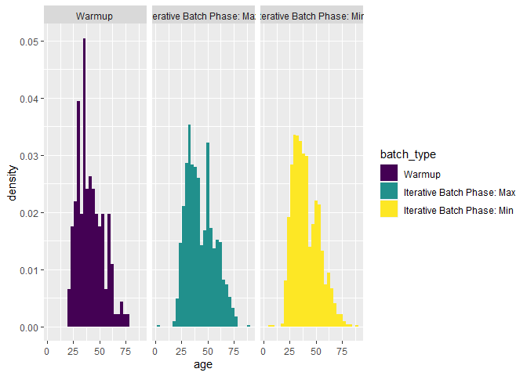
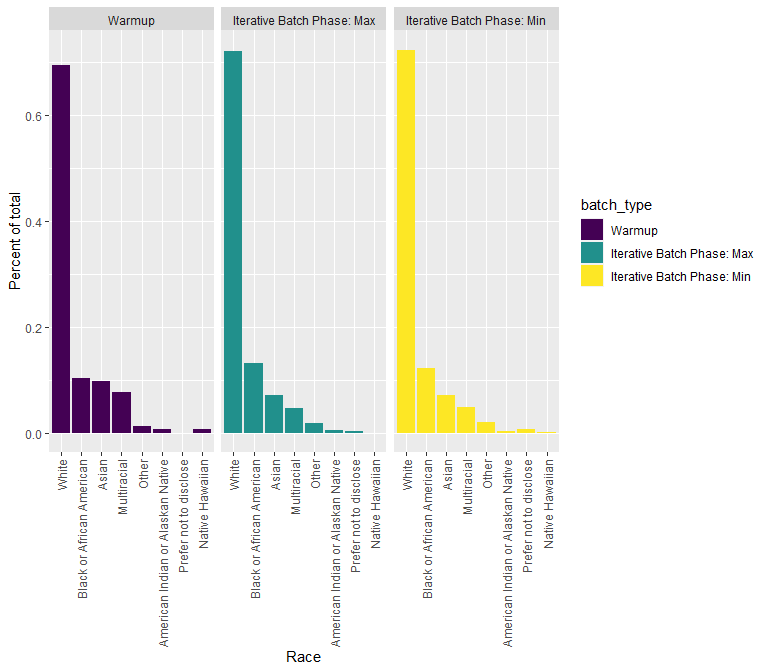

Demographic Breakdowns by Experimental Phase: Job Applicants Experiment
================
2024-01-09

# Loading survey data

- Includes warmup, iterative batch phases, and validation

``` r
df <- readRDS("../../02_output/job_applicants_data_clean.RDS")

df <- df %>%
  mutate(batch_type = factor(batch_type,
    levels = c("Warmup", "Iterative Batch Phase: Max", "Iterative Batch Phase: Min", "Validation"),
    ordered = TRUE
  ))

# look at sample counts by batch id and batch type
df %>%
  group_by(batch_type, batch_id) %>%
  summarize(n = n())
```

    ## `summarise()` has grouped output by 'batch_type'. You can override using the
    ## `.groups` argument.

    ## # A tibble: 41 × 3
    ## # Groups:   batch_type [3]
    ##    batch_type                 batch_id     n
    ##    <ord>                         <dbl> <int>
    ##  1 Warmup                            0   154
    ##  2 Iterative Batch Phase: Max        1    99
    ##  3 Iterative Batch Phase: Max        2    99
    ##  4 Iterative Batch Phase: Max        3    94
    ##  5 Iterative Batch Phase: Max        4    97
    ##  6 Iterative Batch Phase: Max        5    97
    ##  7 Iterative Batch Phase: Max        6    97
    ##  8 Iterative Batch Phase: Max        7    98
    ##  9 Iterative Batch Phase: Max        8    96
    ## 10 Iterative Batch Phase: Max        9    95
    ## # ℹ 31 more rows

``` r
df %>%
  group_by(batch_type) %>%
  summarize(n = n())
```

    ## # A tibble: 3 × 2
    ##   batch_type                     n
    ##   <ord>                      <int>
    ## 1 Warmup                       154
    ## 2 Iterative Batch Phase: Max  1951
    ## 3 Iterative Batch Phase: Min  1948

## Examining female and hispanicity

- There are some differences in the percent female between the different
  phases (around 10 percentage points)

``` r
## look at female and hispanicity
df %>%
  group_by(batch_type) %>%
  summarize(across(c("female", "hispanic"), .fns = lst(
    n = ~ sum(.),
    per = ~ mean(.)
  )))
```

    ## # A tibble: 3 × 5
    ##   batch_type                 female_n female_per hispanic_n hispanic_per
    ##   <ord>                         <int>      <dbl>      <int>        <dbl>
    ## 1 Warmup                           81      0.526         18       0.117 
    ## 2 Iterative Batch Phase: Max     1000      0.513        149       0.0764
    ## 3 Iterative Batch Phase: Min     1092      0.561        175       0.0898

## Examining differences in ages

- Distribution seems similar across phases

``` r
# age
df %>%
  group_by(batch_type, age) %>%
  summarize(n = n()) %>%
  group_by(batch_type) %>%
  mutate(per = n / sum(n)) %>%
  arrange(age)
```

    ## `summarise()` has grouped output by 'batch_type'. You can override using the
    ## `.groups` argument.

    ## # A tibble: 178 × 4
    ## # Groups:   batch_type [3]
    ##    batch_type                   age     n      per
    ##    <ord>                      <dbl> <int>    <dbl>
    ##  1 Iterative Batch Phase: Max     4     1 0.000513
    ##  2 Iterative Batch Phase: Min     5     1 0.000513
    ##  3 Iterative Batch Phase: Min     8     1 0.000513
    ##  4 Iterative Batch Phase: Max    17     1 0.000513
    ##  5 Iterative Batch Phase: Min    18     1 0.000513
    ##  6 Iterative Batch Phase: Max    19     4 0.00205 
    ##  7 Iterative Batch Phase: Min    19     2 0.00103 
    ##  8 Iterative Batch Phase: Max    20     4 0.00205 
    ##  9 Iterative Batch Phase: Min    20    10 0.00513 
    ## 10 Iterative Batch Phase: Max    21     8 0.00410 
    ## # ℹ 168 more rows

``` r
df %>%
  # remove outlier
  filter(age < 100) %>%
  ggplot(aes(age, after_stat(density), fill = batch_type)) +
  geom_histogram() +
  facet_wrap(~batch_type)
```

    ## `stat_bin()` using `bins = 30`. Pick better value with `binwidth`.

<!-- -->

## Examining differences in race

- Distribution also is similar across batches

``` r
# race
df %>%
  group_by(batch_type) %>%
  group_by(race) %>%
  summarize(n = n()) %>%
  ungroup() %>%
  mutate(per = n / sum(n)) %>%
  arrange(desc(per))
```

    ## # A tibble: 8 × 3
    ##   race                                  n     per
    ##   <chr>                             <int>   <dbl>
    ## 1 White                              2924 0.721  
    ## 2 Black or African American           513 0.127  
    ## 3 Asian                               293 0.0723 
    ## 4 Multiracial                         200 0.0493 
    ## 5 Other                                79 0.0195 
    ## 6 Prefer not to disclose               20 0.00493
    ## 7 American Indian or Alaskan Native    19 0.00469
    ## 8 Native Hawaiian                       5 0.00123

``` r
df %>%
  group_by(batch_type, race) %>%
  summarize(n = n()) %>%
  group_by(batch_type) %>%
  mutate(per = n / sum(n)) %>%
  arrange(desc(per)) %>%
  ggplot(aes(reorder(race, desc(per)), per, fill = batch_type)) +
  geom_col() +
  facet_wrap(~batch_type) +
  labs(
    x = "Race",
    y = "Percent of total"
  ) +
  theme(axis.text.x = element_text(angle = 90, vjust = 0.5, hjust = 1))
```

    ## `summarise()` has grouped output by 'batch_type'. You can override using the
    ## `.groups` argument.

<!-- -->
