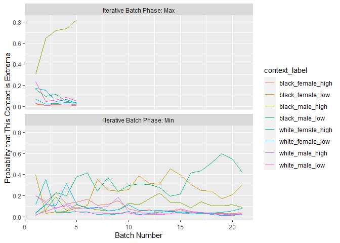
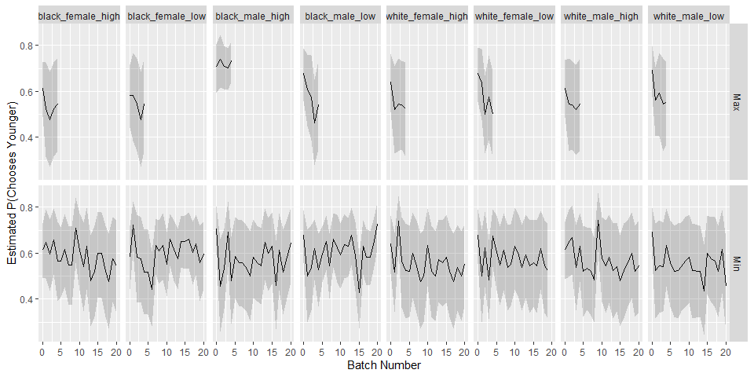
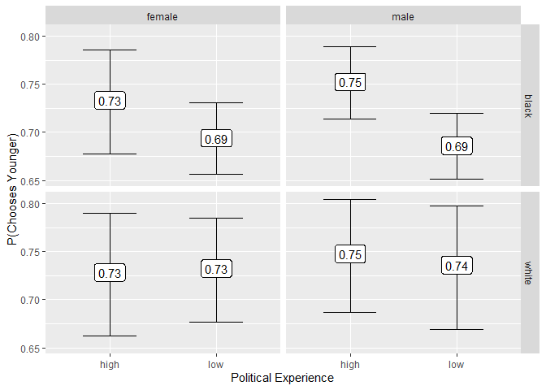
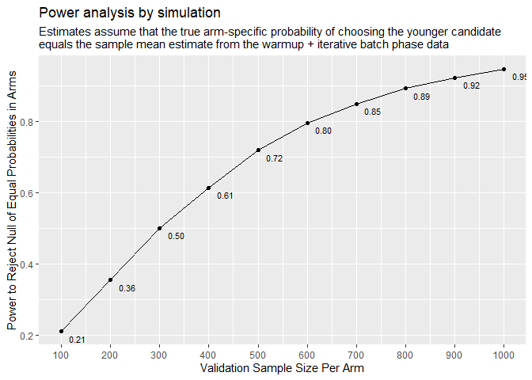
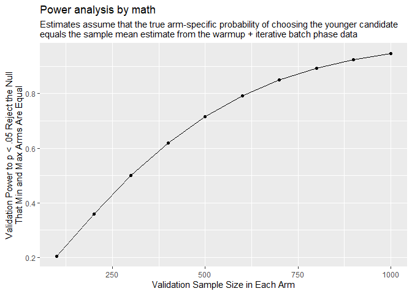

Prep for validation
================
Ian
2024-01-08

    ## # A tibble: 25 × 3
    ## # Groups:   batch_type [3]
    ##    batch_type                 batch_id     n
    ##    <chr>                         <dbl> <int>
    ##  1 Iterative Batch Phase: Max        1    99
    ##  2 Iterative Batch Phase: Max        2   100
    ##  3 Iterative Batch Phase: Max        3   100
    ##  4 Iterative Batch Phase: Max        4   100
    ##  5 Iterative Batch Phase: Min        1   100
    ##  6 Iterative Batch Phase: Min        2   101
    ##  7 Iterative Batch Phase: Min        3   100
    ##  8 Iterative Batch Phase: Min        4    99
    ##  9 Iterative Batch Phase: Min        5   101
    ## 10 Iterative Batch Phase: Min        6   100
    ## # ℹ 15 more rows

Across batches, the max estimate converged very quickly and the min
estimate never converged.

<!-- -->

Below is the estimated probability of choosing the younger candidate,
across rounds, with 95% credible interval.

``` r
bayes_result <- foreach(target = c("Min","Max"), .combine = "rbind") %do% {
  data %>%
    filter(batch_type %in% c("Warmup",paste0("Iterative Batch Phase: ",target))) %>%
    group_by(context_label, batch_id) %>%
    arrange(batch_id) %>%
    mutate(alpha = cumsum(chose_younger) + 10,
           beta = cumsum(1 - chose_younger) + 10) %>%
    group_by(batch_id, context_label) %>%
    slice_tail(n = 1) %>%
    mutate(estimate = alpha / (alpha + beta),
           ci.min = qbeta(.025, shape1 = alpha, shape2 = beta),
           ci.max = qbeta(.975, shape1 = alpha, shape2 = beta)) %>%
    mutate(target = target)
}

bayes_result %>%
  ggplot(aes(x = batch_id, y = estimate, 
             ymin = ci.min, ymax = ci.max)) +
  geom_line() + 
  geom_ribbon(alpha = .2) +
  facet_grid(target ~ context_label) +
  ylab("Estimated P(Chooses Younger)") +
  xlab("Batch Number")
```

<!-- -->

The two extreme contexts are black male with (high or low experience).
This suggests that when presented with a black male candidate, the
preference for a younger candidate is much stronger when they are both
experienced.

    ## [1] 5 6

    ## # A tibble: 2 × 5
    ## # Groups:   type [2]
    ##   batch type                       context probability context_label  
    ##   <dbl> <chr>                        <dbl>       <dbl> <chr>          
    ## 1     5 Iterative Batch Phase: Max       5       0.82  black_male_high
    ## 2    21 Iterative Batch Phase: Min       6       0.413 black_male_low

# Pooling all data

Below are the estimates for all contexts, using all the data collected
in all phases.

    ## `summarise()` has grouped output by 'context'. You can override using the
    ## `.groups` argument.

<!-- -->

For the validation study, we would like to have power to detect a
difference between the two extreme contexts. The point estimates for
those are 0.75 and 0.69. Assuming these are the truth, we can calculate
the power at various validation sample sizes. Below I do this by
simulation and then analytically, with the same result.

    ## [1] 0.7626775 0.6916300

<!-- -->

<!-- -->
