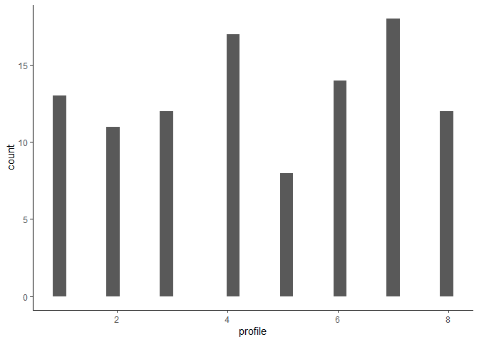
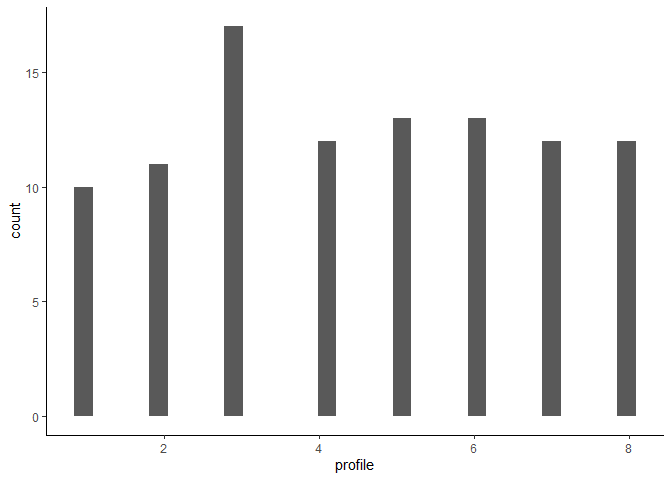
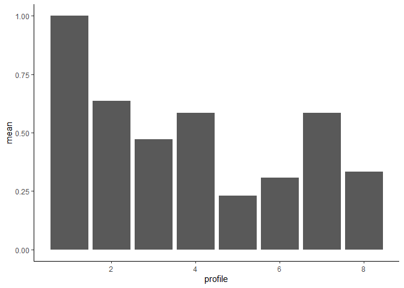

Process Qualtrics Data, Treatment Assignment Updating
================
2023-11-07

# Setup Data Using Qualtrics API

- Load data directly from Qualtrics
- Can store API Key and credentials in `.renviron`

``` r
library(tidyverse)
library(qualtRics)
library(magrittr)
library(assertr)
library(RColorBrewer)

knitr::opts_chunk$set(cache.extra = 2023)

source("./plotting_functions.R")
source("./data_cleaning.R")
source("./experiment_functions.R")
```

``` r
# datacenterid <- ""
# url <- str_glue("https://{datacenterid}.qualtrics.com")
# api_key <- ""
#
# qualtrics_api_credentials(api_key = api_key,
#                           base_url = url,
#                           install = TRUE,
#                           overwrite=T)


df <- load_qualtrics("Political Candidates")
```

    ##   |                                                                              |                                                                      |   0%  |                                                                              |======================================================================| 100%

    ## 
    ## ── Column specification ────────────────────────────────────────────────────────
    ## cols(
    ##   .default = col_character(),
    ##   StartDate = col_datetime(format = ""),
    ##   EndDate = col_datetime(format = ""),
    ##   Progress = col_double(),
    ##   `Duration (in seconds)` = col_double(),
    ##   Finished = col_logical(),
    ##   RecordedDate = col_datetime(format = ""),
    ##   RecipientLastName = col_logical(),
    ##   RecipientFirstName = col_logical(),
    ##   RecipientEmail = col_logical(),
    ##   ExternalReference = col_logical(),
    ##   LocationLatitude = col_double(),
    ##   LocationLongitude = col_double(),
    ##   QD2_1_TEXT = col_double(),
    ##   rnum = col_double(),
    ##   pi1 = col_double(),
    ##   pi2 = col_double(),
    ##   pi3 = col_double(),
    ##   pi4 = col_double(),
    ##   pi5 = col_double(),
    ##   pi6 = col_double()
    ##   # ... with 16 more columns
    ## )
    ## ℹ Use `spec()` for the full column specifications.

``` r
df %>%
  head()
```

    ## # A tibble: 6 × 71
    ##   StartDate           EndDate             Status IPAdd…¹ Progr…² Durat…³ Finis…⁴
    ##   <dttm>              <dttm>              <chr>  <chr>     <dbl>   <dbl> <lgl>  
    ## 1 2023-06-14 15:56:27 2023-06-14 15:56:27 Surve… <NA>        100       0 TRUE   
    ## 2 2023-06-14 15:56:36 2023-06-14 15:56:36 Surve… <NA>        100       0 TRUE   
    ## 3 2023-06-14 17:57:21 2023-06-14 17:57:21 Surve… <NA>        100       0 TRUE   
    ## 4 2023-06-14 17:57:28 2023-06-14 17:57:28 Surve… <NA>        100       0 TRUE   
    ## 5 2023-06-14 18:03:38 2023-06-14 18:03:38 Surve… <NA>        100       0 TRUE   
    ## 6 2023-06-14 18:03:39 2023-06-14 18:03:39 Surve… <NA>        100       0 TRUE   
    ## # … with 64 more variables: RecordedDate <dttm>, ResponseId <chr>,
    ## #   RecipientLastName <lgl>, RecipientFirstName <lgl>, RecipientEmail <lgl>,
    ## #   ExternalReference <lgl>, LocationLatitude <dbl>, LocationLongitude <dbl>,
    ## #   DistributionChannel <chr>, UserLanguage <chr>, Consent <ord>,
    ## #   `Prolific ID Q` <chr>, PreScreen_Q1 <ord>, Commitment_Q1 <ord>,
    ## #   Commitment_Q2 <chr>, Q1 <ord>, Q2 <ord>, Q3 <ord>, Q4 <ord>, Q5 <ord>,
    ## #   Q6 <ord>, Q7 <ord>, Q8 <ord>, Manipulation_Q1 <ord>, QD2 <ord>, …

## Survey Validation

``` r
df %>%
  distinct(Status)
```

    ## # A tibble: 3 × 1
    ##   Status        
    ##   <chr>         
    ## 1 Survey Preview
    ## 2 IP Address    
    ## 3 Survey Test

``` r
# filter for test data
# replace with real data when running hte survey
df <- df %>%
  filter_test_data()

# check consent means their responses are missing
df %>%
  check_consent()

# check that all completed
df %>%
  check_completion()

df %>%
  # note: question was different prior to 11/06
  filter(StartDate >= lubridate::ymd("2023-11-06")) %>%
  check_location_screen()
```

``` r
# create profile variable
df <- df %>%
  create_profile_var()

df %>%
  ggplot(aes(profile)) +
  geom_histogram() +
  theme_classic()
```

    ## `stat_bin()` using `bins = 30`. Pick better value with `binwidth`.

<!-- -->

## Clean Qualtrics Data

``` r
df_clean <- clean_qualtrics_data(df)

# each question number is the random ordering of the context attributes
df_clean %>%
  select(candidate_response, str_c("Q", 1:8), profile) %>%
  verify(!is.na(candidate_response))
```

    ## # A tibble: 105 × 10
    ##    candidate_response    Q1    Q2    Q3    Q4    Q5    Q6    Q7    Q8 profile
    ##                 <dbl> <dbl> <dbl> <dbl> <dbl> <dbl> <dbl> <dbl> <dbl>   <dbl>
    ##  1                  0    NA    NA    NA    NA     0    NA    NA    NA       1
    ##  2                  1    NA    NA    NA    NA     1    NA    NA    NA       4
    ##  3                  0    NA    NA    NA    NA    NA    NA    NA    NA       6
    ##  4                  0    NA    NA     0    NA    NA    NA    NA    NA       3
    ##  5                  1    NA    NA    NA    NA    NA     1    NA    NA       1
    ##  6                  0    NA    NA    NA    NA    NA    NA    NA    NA       6
    ##  7                  0    NA    NA    NA    NA    NA    NA    NA    NA       8
    ##  8                  0    NA    NA    NA    NA    NA    NA    NA    NA       4
    ##  9                  0    NA    NA    NA    NA    NA    NA    NA    NA       3
    ## 10                  1     1    NA    NA    NA    NA    NA    NA    NA       8
    ## # … with 95 more rows

## Clean Data Validation

``` r
# check every respondent has exactly one non-missing value
df %>%
  select(str_c("Q", 1:8)) %>%
  mutate(across(everything(), ~ as.character(.))) %>%
  is.na() %>%
  rowSums(na.rm = T)
```

    ##   [1] 7 7 8 7 7 8 8 8 8 7 8 7 7 8 8 7 8 8 8 7 7 7 7 8 7 7 8 8 8 8 7 8 7 7 7 7 8
    ##  [38] 7 8 8 8 8 7 8 7 7 8 7 8 7 8 7 7 8 7 8 8 8 8 8 7 7 7 7 8 7 7 8 7 7 8 7 8 7
    ##  [75] 8 8 8 8 8 8 7 8 8 8 7 8 8 8 7 7 7 8 7 8 8 8 8 7 7 8 8 7 8 7 7

``` r
# check row total is not more than 1
# 0 if selected the older candidate
df_clean %>%
  select(str_c("Q", 1:8)) %>%
  rowSums(na.rm = T) %>%
  is_weakly_less_than(1) %>%
  all() %>%
  stopifnot()
```

## Create fake data

``` r
# batch size is the size of the batches (here = 100)
batch_size <- 100

# probabilities of selecting younger candidate
profile_prob <- c(0.9, 0.5, 0.3, 0.5, 0.4, 0.3, 0.5, 0.44)
pi <- cumsum(rep(0.125, 8)) # treatment assignment probabilities (CDF)
```

``` r
df_fake <- create_fake_data(pi, profile_prob, batch_size)
df_fake
```

    ## # A tibble: 100 × 2
    ##    candidate_response profile
    ##                 <int>   <dbl>
    ##  1                  0       7
    ##  2                  0       6
    ##  3                  0       5
    ##  4                  1       1
    ##  5                  1       3
    ##  6                  0       8
    ##  7                  0       3
    ##  8                  0       7
    ##  9                  0       8
    ## 10                  0       4
    ## # … with 90 more rows

### Examine fake data

- Check distribution of profiles overall and by batch

``` r
df_fake %>%
  ggplot(aes(profile)) +
  geom_histogram() +
  theme_classic()
```

    ## `stat_bin()` using `bins = 30`. Pick better value with `binwidth`.

<!-- -->

``` r
df_fake %>%
  group_by(profile) %>%
  summarize(mean = mean(candidate_response)) %>%
  ggplot(aes(profile, mean)) +
  geom_col() +
  theme_classic()
```

<!-- -->

``` r
df_fake %>%
  # share of respondents who select
  # the younger candidate
  group_by(profile) %>%
  summarize(
    mean = mean(candidate_response),
    total = sum(candidate_response)
  )
```

    ## # A tibble: 8 × 3
    ##   profile  mean total
    ##     <dbl> <dbl> <int>
    ## 1       1 1        10
    ## 2       2 0.636     7
    ## 3       3 0.471     8
    ## 4       4 0.583     7
    ## 5       5 0.231     3
    ## 6       6 0.308     4
    ## 7       7 0.583     7
    ## 8       8 0.333     4

# Update treatment probabilities

``` r
# define with comments
num_profiles <- 8 # number of profiles
num_sim <- 1000 # number of simulations for Monte Carlo simulation
eps <- 0.1 # for epsilon greedy alg

N <- 4500 # total number of observations
num_batches <- N / batch_size # total number of batches
pi_init <- cumsum(rep(0.125, 8)) # initial pi cdf
```

``` r
# generate pi on fake data
pi_ts_fake <- run_ts(batch_size, pi_init, fake_data = T)
pi_ts_fake
```

    ## $`output$pi`
    ## [1] 0.886 0.962 0.962 0.962 0.962 0.970 0.991 1.000

``` r
# generate pi on real data
pi_ts <- run_ts(batch_size, pi_init, fake_data = F)
```

    ##   |                                                                              |                                                                      |   0%  |                                                                              |===========================================                           |  62%  |                                                                              |======================================================================| 100%

    ## 
    ## ── Column specification ────────────────────────────────────────────────────────
    ## cols(
    ##   .default = col_character(),
    ##   StartDate = col_datetime(format = ""),
    ##   EndDate = col_datetime(format = ""),
    ##   Progress = col_double(),
    ##   `Duration (in seconds)` = col_double(),
    ##   Finished = col_logical(),
    ##   RecordedDate = col_datetime(format = ""),
    ##   RecipientLastName = col_logical(),
    ##   RecipientFirstName = col_logical(),
    ##   RecipientEmail = col_logical(),
    ##   ExternalReference = col_logical(),
    ##   LocationLatitude = col_double(),
    ##   LocationLongitude = col_double(),
    ##   QD2_1_TEXT = col_double(),
    ##   rnum = col_double(),
    ##   pi1 = col_double(),
    ##   pi2 = col_double(),
    ##   pi3 = col_double(),
    ##   pi4 = col_double(),
    ##   pi5 = col_double(),
    ##   pi6 = col_double()
    ##   # ... with 16 more columns
    ## )
    ## ℹ Use `spec()` for the full column specifications.

``` r
pi_ts
```

    ## $`output$pi`
    ## [1] 0.747 0.788 0.822 0.831 0.973 0.993 0.994 1.000
