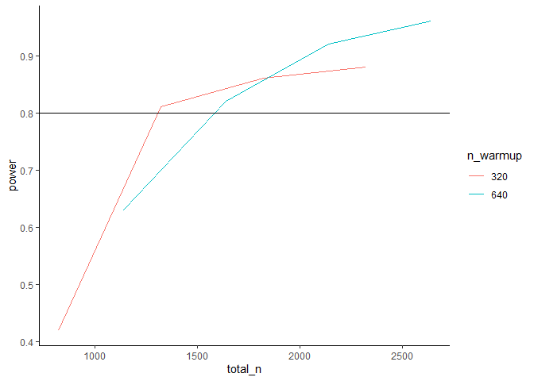

Power Simulation for MAB
================
2024-05-15

``` r
library(tidyverse)
```

    ## ── Attaching core tidyverse packages ──────────────────────── tidyverse 2.0.0 ──
    ## ✔ dplyr     1.1.4     ✔ readr     2.1.4
    ## ✔ forcats   1.0.0     ✔ stringr   1.5.1
    ## ✔ ggplot2   3.4.4     ✔ tibble    3.2.1
    ## ✔ lubridate 1.9.3     ✔ tidyr     1.3.0
    ## ✔ purrr     1.0.2     
    ## ── Conflicts ────────────────────────────────────────── tidyverse_conflicts() ──
    ## ✖ dplyr::filter() masks stats::filter()
    ## ✖ dplyr::lag()    masks stats::lag()
    ## ℹ Use the conflicted package (<http://conflicted.r-lib.org/>) to force all conflicts to become errors

``` r
library(purrr)
library(magrittr)
```

    ## 
    ## Attaching package: 'magrittr'
    ## 
    ## The following object is masked from 'package:purrr':
    ## 
    ##     set_names
    ## 
    ## The following object is masked from 'package:tidyr':
    ## 
    ##     extract

``` r
library(future)
library(furrr)
future::plan(multisession, workers = 4)

source('_functions/experiment_functions.R')
set.seed(2023)
```

``` r
## power simulation
iter <- 1000
n_warmup <- 300
n_iterative <- 2000

# in this, arm 1 is the best
prob <- c(0.7, rep(0.6, 15))

# starting pi values for assigning contexts
pi_vals_cdf <- seq(0, 1, 0.0625)
pi_vals_pdf <- rep(0.0625, 16)

# vector of contexts
contexts <- seq(1, 16, 1)
contexts
```

    ##  [1]  1  2  3  4  5  6  7  8  9 10 11 12 13 14 15 16

``` r
# data generation process
generate_data <- function(n, pdf, true_prob) {
  context_assignment_matrix <- rmultinom(n=n, size=1, prob=pdf)
  context_assignment <- future_map(1:n, ~which(context_assignment_matrix[,.] == 1),
                                   .options = furrr_options(packages = "extraDistr", seed=TRUE)) %>% 
    unlist()

  return(tibble('context' = context_assignment,
                'outcome' = rbinom(n = n,
                                   size=1, prob=true_prob[context_assignment])))
}
```

``` r
# power = prob that we correctly reject the null
# in our case: null = context 1 is not the max discriminatory context
# we want to reject the null
# alternative hypothesis = context 1 is the max discriminatory
# there is a difference between context 1 and others

sim_val5 <- run_simulation(100, 320, 100, 5, pi_vals_pdf, prob, 0.8)
sim_val10 <- run_simulation(100, 320, 100, 10, pi_vals_pdf, prob, 0.8)
sim_val15 <- run_simulation(100, 320, 100, 15, pi_vals_pdf, prob, 0.8)
sim_val20 <- run_simulation(100, 320, 100, 20, pi_vals_pdf, prob, 0.8)
```

``` r
# we want the proportion in which we identify context 1 as correct
tibble(num_batches = c(5, 10, 15, 20),
       power = c(sim_val5$`mean(res$true_context)`, sim_val10$`mean(res$true_context)`, 
                 sim_val15$`mean(res$true_context)`, sim_val20$`mean(res$true_context)`)
       )
```

    ## # A tibble: 4 × 2
    ##   num_batches power
    ##         <dbl> <dbl>
    ## 1           5  0.42
    ## 2          10  0.81
    ## 3          15  0.86
    ## 4          20  0.88

``` r
# optimal stopping
# it is optimal to stop when the difference in average outcomes between the treatments,
# multiplied by the number of observations collected up to that point, exceeds a specific
# threshold
```

``` r
# different warmup
sim_val5_2 <- run_simulation(100, 640, 100, 5, pi_vals_pdf, prob, 0.8)
sim_val10_2 <- run_simulation(100, 640, 100, 10, pi_vals_pdf, prob, 0.8)
sim_val15_2 <- run_simulation(100, 640, 100, 15, pi_vals_pdf, prob, 0.8)
sim_val20_2 <- run_simulation(100, 640, 100, 20, pi_vals_pdf, prob, 0.8)
```

``` r
tibble(total_n = (100*rep(c(5, 10, 15, 20), 2)) + c(rep(320, 4), rep(640, 4)),
       n_warmup = c(rep(320, 4), rep(640, 4)),
       power = c(sim_val5$`mean(res$true_context)`, sim_val10$`mean(res$true_context)`, 
                 sim_val15$`mean(res$true_context)`, sim_val20$`mean(res$true_context)`, 
                 sim_val5_2$`mean(res$true_context)`, sim_val10_2$`mean(res$true_context)`, 
                 sim_val15_2$`mean(res$true_context)`, sim_val20_2$`mean(res$true_context)`)
       ) %>% 
  ggplot(aes(total_n, power, color = as.factor(n_warmup))) +
  geom_line() +
  geom_hline(yintercept=0.8) +
  theme_classic() +
  labs(color = 'n_warmup')
```

<!-- -->
