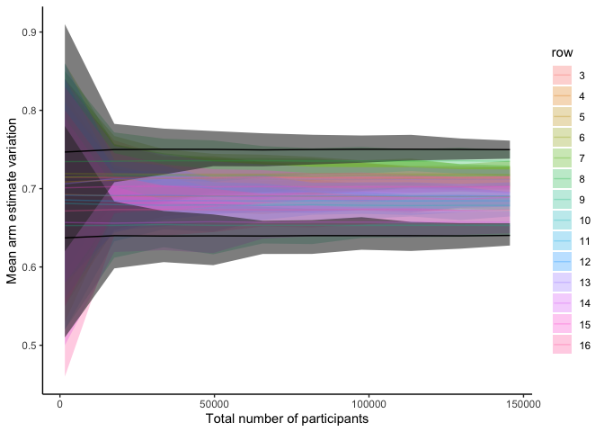

sim-power-multiarm
================
2025-07-28

``` r
mde <- 0.75 - 0.64
arms <- c(1:16)
true_p <- c(c(0.64, 0.75), runif(length(arms)-2, 0.65, 0.74))

draw_sample <- function(n_size, true_p) {
  # return(unlist(map(true_p, ~rbinom(n=1, size=1, prob=.))))
  return(rbinom(n=n_size*length(true_p), size=1, prob=true_p))
}

produce_est <- function(n) {
    # print("#############")
    # print(str_glue("N={n}"))

  est <- lst()
  for (sim in c(1:500)) {
    outcomes <- draw_sample(n, true_p)
    outcomes_df <- outcomes %>% 
      as_tibble() %>% 
      mutate(row = ((row_number()-1) %% 16) + 1)
    
    outcomes_df_grpd <- outcomes_df %>% 
      group_by(row) %>% 
      summarize(mean_est = mean(value)) %>% 
      mutate(n_sim = sim) %>% 
      ungroup()

    test_res <- outcomes_df %>% 
      filter(row %in% c(1,2)) %>% 
      t.test(value ~ row, data = .)
    
    est[[sim]] <- outcomes_df_grpd %>% 
      mutate(reject = case_when(test_res$p.value < 0.05 & row == 1 ~ 1, 
                                test_res$p.value >= 0.05 & row == 1 ~ 0,
                                TRUE ~ NA))
  }
  est_df <- bind_rows(est) %>% 
    mutate(n_size = n,
           power = mean(reject, na.rm = TRUE))
  return(est_df)
}

est_df <- map_dfr(seq(100,10000,1000), ~produce_est(.))
est_df %>% 
  group_by(n_size, row) %>% 
  summarize(mean = mean(mean_est),
         min = min(mean_est),
         max = max(mean_est)) %>% 
  group_by(n_size) %>% 
  mutate(max_est = max(mean),
         max_est_arm = which.max(mean)) %>% 
  #filter(row %in% c(1,2)) %>% 
  mutate(row_label = if_else(row==1, "Min arm", "Max arm")) %>% 
  mutate(total_n = 16*n_size) %>% 
  mutate(row = factor(row)) %>% 
  ungroup() %>% 
  ggplot() +
  #geom_hline(aes(yintercept=0.7), color='red', linetype='dashed') +
  geom_ribbon(data = ~filter(., (row %in% c(3:16))),
                            aes(total_n, ymin=min, ymax=max, fill=row), alpha=0.3) +
  geom_ribbon(data = ~filter(., (row %in% c(1,2))),
                            aes(total_n, ymin=min, ymax=max, group=row), alpha=0.6) +
  geom_line(data = ~filter(., (row %in% c(3:16))),
            aes(total_n, mean, color=row), alpha=0.3) +
  geom_line(data = ~filter(., (row %in% c(1,2))),
            aes(total_n, mean, group=row)) +
  theme_classic() +
  #facet_grid(cols = vars(row_label)) +
  labs(y = 'Mean arm estimate variation',
       x = 'Total number of participants')
```

    ## `summarise()` has grouped output by 'n_size'. You can override using the
    ## `.groups` argument.

<!-- -->
