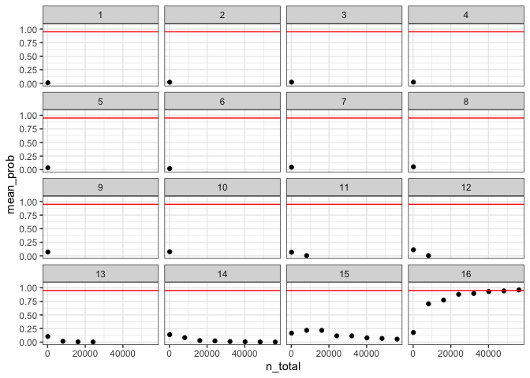
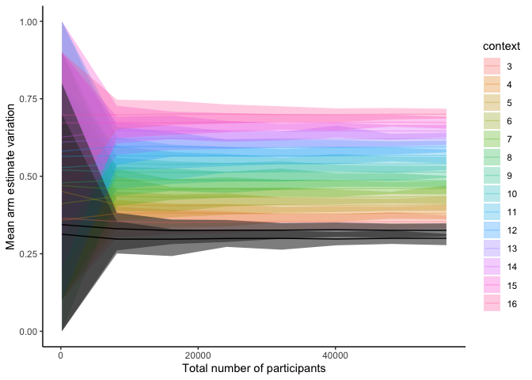
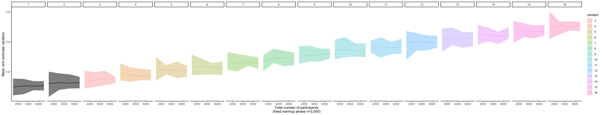

sim-power-multiarm
================
2025-08-13

## Static/fixed 16-arm experiment

``` r
arms <- c(1:16)
true_p <- c(c(0.64, 0.75), runif(length(arms)-2, 0.66, 0.73))

draw_sample <- function(n_size, true_p) {
  # return(unlist(map(true_p, ~rbinom(n=1, size=1, prob=.))))
  return(rbinom(n=n_size*length(true_p), size=1, prob=true_p))
}

draw_adaptive_sample <- function(pi, true_p) {
  profile_draw <- rmultinom(1, 1, rep(1,16)/1)
  stopifnot(sum(profile_draw)==1)
  context <- which.max(profile_draw)
  
  output <- rep(NA, 16)
  draw <- rbinom(n=1, size=1, prob=true_p[context])
  output[context] <- draw
  return(output)
}

format_sample_df <- function(sample_draws) {
  sample_draws %>%
    as_tibble() %>%
    mutate(context = ((row_number()-1) %% 16) + 1)
}

produce_est2 <- function(n, true_p, num_sim=100) {
    # print("#############")
    # print(str_glue("N={n}"))

  est <- lst()
  for (sim in c(1:num_sim)) {
    outcomes <- draw_sample(n, true_p)
    outcomes_df <- outcomes %>% 
      format_sample_df()
    
    outcomes_df_grpd <- outcomes_df %>% 
      group_by(context) %>% 
      summarize(mean_est = mean(value),
                y1 = sum(value==1),
                y0 = sum(value==0)) %>% 
      mutate(n_sim = sim) %>% 
      ungroup() 
    
    est[[sim]] <- outcomes_df_grpd
  }
  est_df <- bind_rows(est) %>% 
    mutate(n_size = n)
  return(est_df)
}

produce_est <- function(n, true_p, num_sim=100) {
    # print("#############")
    # print(str_glue("N={n}"))

  est <- lst()
  for (sim in c(1:num_sim)) {
    outcomes <- draw_sample(n, true_p)
    outcomes_df <- outcomes %>% 
      format_sample_df()
    
    outcomes_df_grpd <- outcomes_df %>% 
      group_by(context) %>% 
      summarize(mean_est = mean(value),
                y1 = sum(value==1),
                y0 = sum(value==0)) %>% 
      mutate(n_sim = sim) %>% 
      ungroup()  %>% 
      mutate(theta_star = map2(.x = y1, .y = y0, 
                               .f = \(x,y) rbeta(1000, 
                                                 x + 1, y + 1))) %>% 
            unnest(theta_star)  %>% 
      group_by(context) %>% 
      mutate(index = 1:1000) %>% 
      arrange(index, context) %>% 
      group_by(index, n_sim) %>% 
      summarize(max_arm = which.max(theta_star)) %>% 
      group_by(max_arm, n_sim) %>% 
      summarize(prob = n()/1000)
    
    est[[sim]] <- outcomes_df_grpd
  }
  est_df <- bind_rows(est) %>% 
    mutate(n_size = n)
  return(est_df)
}
```

## Produce simulations for a fixed experiment

``` r
# est_df <- map_dfr(seq(100,10000,1000), ~produce_est(.))
# 
# # using Bayes approach from Ian
# est_df_bayes <- cbind(est_df, map2_dfr(est_df$y1, est_df$y0, ~tibble(theta = rbeta(100, 1 + .x, 1 + .y)) %>%
#   summarize(
#       theta_hat = mean(theta),
#       theta_ci_min = quantile(theta, .025),
#       theta_ci_max = quantile(theta, .975))))
```

``` r
#true_p <- c(c(0.64, 0.75), runif(length(arms)-2, 0.66, 0.73))
#true_p <- seq(0.6, 0.7, length.out = 16)
true_p <- seq(0.3, 0.7, length.out = 16)
true_p
```

    ##  [1] 0.3000000 0.3266667 0.3533333 0.3800000 0.4066667 0.4333333 0.4600000
    ##  [8] 0.4866667 0.5133333 0.5400000 0.5666667 0.5933333 0.6200000 0.6466667
    ## [15] 0.6733333 0.7000000

``` r
est_df <- map_dfr(seq(10,4000,500), ~produce_est(., true_p))

est_df %>% 
  mutate(n_total = n_size*16) %>% 
  group_by(n_total, max_arm) %>% 
  summarize(mean_prob = mean(prob),
            prob_ci_min = quantile(prob, 0.025),
            prob_ci_max = quantile(prob, 0.975)) %>% 
  ggplot(aes(n_total, mean_prob)) +
  geom_point() +
  geom_hline(yintercept=0.95, color='red') +
  facet_wrap(~max_arm) +
  scale_y_continuous(limits=c(0,1.05))
```

<!-- -->

``` r
# using Bayes approach from Ian
# est_df_bayes <- map2_dfr(est_df$y1, est_df$y0, ~tibble(theta = rbeta(100, 1 + .x, 1 + .y)) %>%
#   summarize(
#       theta_hat = mean(theta),
#       theta_ci_min = quantile(theta, .025),
#       theta_ci_max = quantile(theta, .975))))
# 
# est_df_bayes
```

``` r
est_df2 <- map_dfr(seq(10,4000,500), ~produce_est2(., true_p))

est_df2 %>% 
  group_by(n_size, context) %>% 
  summarize(mean = mean(mean_est),
         min = min(mean_est),
         max = max(mean_est)) %>% 
  group_by(n_size) %>% 
  mutate(max_est = max(mean),
         max_est_arm = which.max(mean)) %>% 
  #filter(row %in% c(1,2)) %>% 
  mutate(context_label = if_else(context==1, "Min arm", "Max arm")) %>% 
  mutate(total_n = 16*n_size) %>% 
  mutate(context = factor(context)) %>% 
  ungroup() %>% 
  ggplot() +
  #geom_hline(aes(yintercept=0.7), color='red', linetype='dashed') +
  geom_ribbon(data = ~filter(., (context %in% c(3:16))),
                            aes(total_n, ymin=min, ymax=max, fill=context), alpha=0.3) +
  geom_ribbon(data = ~filter(., (context %in% c(1,2))),
                            aes(total_n, ymin=min, ymax=max, group=context), alpha=0.6) +
  geom_line(data = ~filter(., (context %in% c(3:16))),
            aes(total_n, mean, color=context), alpha=0.3) +
  geom_line(data = ~filter(., (context %in% c(1,2))),
            aes(total_n, mean, group=context)) +
  theme_classic() +
  #facet_grid(cols = vars(row_label)) +
  labs(y = 'Mean arm estimate variation',
       x = 'Total number of participants')
```

    ## `summarise()` has grouped output by 'n_size'. You can override using the
    ## `.groups` argument.

<!-- -->

``` r
est_df2 <- map_dfr(seq(100,1000,100), ~produce_est2(., true_p))

est_df_bayes <- cbind(est_df2, map2_dfr(est_df2$y1, est_df2$y0, ~tibble(theta = rbeta(100, 1 + .x, 1 + .y)) %>%
  summarize(
      theta_hat = mean(theta),
      theta_ci_min = quantile(theta, .025),
      theta_ci_max = quantile(theta, .975))))

est_df_bayes %>% 
  head()
```

    ##   context mean_est y1 y0 n_sim n_size theta_hat theta_ci_min theta_ci_max
    ## 1       1     0.38 38 62     1    100 0.3860305    0.2947836    0.4498183
    ## 2       2     0.32 32 68     1    100 0.3258626    0.2339353    0.4168421
    ## 3       3     0.43 43 57     1    100 0.4319795    0.3368525    0.5318795
    ## 4       4     0.39 39 61     1    100 0.3846457    0.3056051    0.4731690
    ## 5       5     0.40 40 60     1    100 0.3942660    0.3066683    0.4831356
    ## 6       6     0.37 37 63     1    100 0.3741231    0.2932189    0.4843723

``` r
unique(est_df_bayes$n_size) %>% 
  head()
```

    ## [1] 100 200 300 400 500 600

``` r
est_df_bayes %>% 
  filter(context %in% c(1,2)) %>% 
  mutate(total_n = 16*n_size) %>% 
  filter(n_size %in% c(100, 200, 400, 800, 1000)) %>% 
  ggplot(aes(n_sim, theta_hat)) +
  geom_ribbon(aes(n_sim, ymin=theta_ci_min, ymax=theta_ci_max), fill='gray', alpha=0.8) +
  geom_point() +
  facet_grid(cols = vars(context),
             rows = vars(total_n)) +
  labs(y = "Estimated Theta")
```

<!-- -->

## Adaptive experiment simulation

``` r
update_outcomes <- function(df, num_contexts) {
  # vector of num outcomes for either 1 or 0
  df %>% 
    mutate(chose_educ0 = if_else(chose_educ==0 & !is.na(chose_educ), 1, 0)) %>% 
    group_by(context) %>% 
    summarize(chose1 = sum(chose_educ, na.rm = TRUE),
              chose0 = sum(chose_educ0, na.rm = TRUE))
}

update_ts <- function(df, num_sim, num_contexts, type) {
  # with the data provided
  # calculated the observed outcomes = 1, and outcomes = 0
  
  df_outcomes <- df %>% 
    update_outcomes(., num_contexts)
  
  num_outcome1 <- df_outcomes %>% 
    pull(chose1)
  
  num_outcome0 <- df_outcomes %>% 
    pull(chose0)

  # calculate the probability that each arm is the best
  draws <- replicate(num_sim, rbeta(num_contexts, num_outcome1 + 1, num_outcome0 + 1))
  if (type == "max") {
    #print("Predicting the most discriminatory context: taking the argmax")
    # calculate argmax across draws
    arg <- apply(draws, 2, which.max)
  } else if (type == "min") {
    #print("Predicting the least discriminatory context: taking the argmin")
    # calculate argmin across draws
    arg <- apply(draws, 2, which.min)
  } else {
    print("Direction 'type' is unclear")
  }

  # generate new pi
  # print(arg)
  # print(table(cut(arg, 0:num_contexts)))
  pi <- unname(table(cut(arg, 0:num_contexts)) / num_sim)
  #print(str_c("PDF: ", str_c(pi, collapse = ",")))
  stopifnot(length(pi) == num_contexts)
  return(pi)
}

adaptive_phase <- function(warmup_df, n_total, n_sim=1000) {
  pi <- rep(1, 16)/16
  df <- warmup_df
  for (i in c(1:n_total)) {
    adaptive_draw <- draw_adaptive_sample(pi, true_p) %>% 
      format_sample_df() %>% 
      rename(chose_educ = value)
    
    df <- bind_rows(df, adaptive_draw)
    pi <- update_ts(df, n_sim, 16, "max")
    stopifnot(abs(sum(pi)-1) < 0.05)
  }
  outcomes <- df %>% 
    update_outcomes(16)
  
  return(lst(outcomes, pi))
}

full_experiment <- function(n_warmup, n_adaptive, true_p) {
  warmup_df <- draw_sample(n_warmup/16, true_p) %>% 
    format_sample_df() %>% 
    rename(chose_educ = value)
  return(adaptive_phase(warmup_df, n_adaptive))
}
```

``` r
adaptive_warmupfixed <- function(n, true_p) {
  print("###########")
  print(str_glue("Running for n={n}"))
  adaptive_res <- full_experiment(125*16, n, true_p)
  final_pi <- adaptive_res$pi
  final_outcomes <- adaptive_res$outcomes
  mean_estimates_df <- final_outcomes %>% 
    rowwise() %>% 
    mutate(chose_n = chose1 + chose0,
           mean_est = chose1 / chose_n) %>% 
    ungroup() %>% 
    mutate(n_adaptive = n)
  return(mean_estimates_df)
}

# testing for fixed warmup
n_sim <- 20
tic()
mean_estimates_warmupfixed <- future_map_dfr(1:n_sim, ~adaptive_warmupfixed(1000, true_p), seed=TRUE) %>% 
  bind_rows(future_map_dfr(1:n_sim, ~adaptive_warmupfixed(3000, true_p), seed=TRUE)) %>% 
  bind_rows(future_map_dfr(1:n_sim, ~adaptive_warmupfixed(5000, true_p), seed=TRUE)) %>% 
  bind_rows(future_map_dfr(1:n_sim, ~adaptive_warmupfixed(7000, true_p), seed=TRUE))
```

    ## [1] "###########"
    ## Running for n=1000
    ## [1] "###########"
    ## Running for n=1000
    ## [1] "###########"
    ## Running for n=1000
    ## [1] "###########"
    ## Running for n=1000
    ## [1] "###########"
    ## Running for n=1000
    ## [1] "###########"
    ## Running for n=1000
    ## [1] "###########"
    ## Running for n=1000
    ## [1] "###########"
    ## Running for n=1000
    ## [1] "###########"
    ## Running for n=1000
    ## [1] "###########"
    ## Running for n=1000

    ## Warning: UNRELIABLE VALUE: Future ('<none>') unexpectedly generated random
    ## numbers without specifying argument 'seed'. There is a risk that those random
    ## numbers are not statistically sound and the overall results might be invalid.
    ## To fix this, specify 'seed=TRUE'. This ensures that proper, parallel-safe
    ## random numbers are produced via the L'Ecuyer-CMRG method. To disable this
    ## check, use 'seed=NULL', or set option 'future.rng.onMisuse' to "ignore".

    ## [1] "###########"
    ## Running for n=1000
    ## [1] "###########"
    ## Running for n=1000
    ## [1] "###########"
    ## Running for n=1000
    ## [1] "###########"
    ## Running for n=1000
    ## [1] "###########"
    ## Running for n=1000
    ## [1] "###########"
    ## Running for n=1000
    ## [1] "###########"
    ## Running for n=1000
    ## [1] "###########"
    ## Running for n=1000
    ## [1] "###########"
    ## Running for n=1000
    ## [1] "###########"
    ## Running for n=1000

    ## Warning: UNRELIABLE VALUE: Future ('<none>') unexpectedly generated random
    ## numbers without specifying argument 'seed'. There is a risk that those random
    ## numbers are not statistically sound and the overall results might be invalid.
    ## To fix this, specify 'seed=TRUE'. This ensures that proper, parallel-safe
    ## random numbers are produced via the L'Ecuyer-CMRG method. To disable this
    ## check, use 'seed=NULL', or set option 'future.rng.onMisuse' to "ignore".

    ## [1] "###########"
    ## Running for n=3000
    ## [1] "###########"
    ## Running for n=3000
    ## [1] "###########"
    ## Running for n=3000
    ## [1] "###########"
    ## Running for n=3000
    ## [1] "###########"
    ## Running for n=3000
    ## [1] "###########"
    ## Running for n=3000
    ## [1] "###########"
    ## Running for n=3000
    ## [1] "###########"
    ## Running for n=3000
    ## [1] "###########"
    ## Running for n=3000
    ## [1] "###########"
    ## Running for n=3000

    ## Warning: UNRELIABLE VALUE: Future ('<none>') unexpectedly generated random
    ## numbers without specifying argument 'seed'. There is a risk that those random
    ## numbers are not statistically sound and the overall results might be invalid.
    ## To fix this, specify 'seed=TRUE'. This ensures that proper, parallel-safe
    ## random numbers are produced via the L'Ecuyer-CMRG method. To disable this
    ## check, use 'seed=NULL', or set option 'future.rng.onMisuse' to "ignore".

    ## [1] "###########"
    ## Running for n=3000
    ## [1] "###########"
    ## Running for n=3000
    ## [1] "###########"
    ## Running for n=3000
    ## [1] "###########"
    ## Running for n=3000
    ## [1] "###########"
    ## Running for n=3000
    ## [1] "###########"
    ## Running for n=3000
    ## [1] "###########"
    ## Running for n=3000
    ## [1] "###########"
    ## Running for n=3000
    ## [1] "###########"
    ## Running for n=3000
    ## [1] "###########"
    ## Running for n=3000

    ## Warning: UNRELIABLE VALUE: Future ('<none>') unexpectedly generated random
    ## numbers without specifying argument 'seed'. There is a risk that those random
    ## numbers are not statistically sound and the overall results might be invalid.
    ## To fix this, specify 'seed=TRUE'. This ensures that proper, parallel-safe
    ## random numbers are produced via the L'Ecuyer-CMRG method. To disable this
    ## check, use 'seed=NULL', or set option 'future.rng.onMisuse' to "ignore".

    ## [1] "###########"
    ## Running for n=5000
    ## [1] "###########"
    ## Running for n=5000
    ## [1] "###########"
    ## Running for n=5000
    ## [1] "###########"
    ## Running for n=5000
    ## [1] "###########"
    ## Running for n=5000
    ## [1] "###########"
    ## Running for n=5000
    ## [1] "###########"
    ## Running for n=5000
    ## [1] "###########"
    ## Running for n=5000
    ## [1] "###########"
    ## Running for n=5000
    ## [1] "###########"
    ## Running for n=5000

    ## Warning: UNRELIABLE VALUE: Future ('<none>') unexpectedly generated random
    ## numbers without specifying argument 'seed'. There is a risk that those random
    ## numbers are not statistically sound and the overall results might be invalid.
    ## To fix this, specify 'seed=TRUE'. This ensures that proper, parallel-safe
    ## random numbers are produced via the L'Ecuyer-CMRG method. To disable this
    ## check, use 'seed=NULL', or set option 'future.rng.onMisuse' to "ignore".

    ## [1] "###########"
    ## Running for n=5000
    ## [1] "###########"
    ## Running for n=5000
    ## [1] "###########"
    ## Running for n=5000
    ## [1] "###########"
    ## Running for n=5000
    ## [1] "###########"
    ## Running for n=5000
    ## [1] "###########"
    ## Running for n=5000
    ## [1] "###########"
    ## Running for n=5000
    ## [1] "###########"
    ## Running for n=5000
    ## [1] "###########"
    ## Running for n=5000
    ## [1] "###########"
    ## Running for n=5000

    ## Warning: UNRELIABLE VALUE: Future ('<none>') unexpectedly generated random
    ## numbers without specifying argument 'seed'. There is a risk that those random
    ## numbers are not statistically sound and the overall results might be invalid.
    ## To fix this, specify 'seed=TRUE'. This ensures that proper, parallel-safe
    ## random numbers are produced via the L'Ecuyer-CMRG method. To disable this
    ## check, use 'seed=NULL', or set option 'future.rng.onMisuse' to "ignore".

    ## [1] "###########"
    ## Running for n=7000
    ## [1] "###########"
    ## Running for n=7000
    ## [1] "###########"
    ## Running for n=7000
    ## [1] "###########"
    ## Running for n=7000
    ## [1] "###########"
    ## Running for n=7000
    ## [1] "###########"
    ## Running for n=7000
    ## [1] "###########"
    ## Running for n=7000
    ## [1] "###########"
    ## Running for n=7000
    ## [1] "###########"
    ## Running for n=7000
    ## [1] "###########"
    ## Running for n=7000

    ## Warning: UNRELIABLE VALUE: Future ('<none>') unexpectedly generated random
    ## numbers without specifying argument 'seed'. There is a risk that those random
    ## numbers are not statistically sound and the overall results might be invalid.
    ## To fix this, specify 'seed=TRUE'. This ensures that proper, parallel-safe
    ## random numbers are produced via the L'Ecuyer-CMRG method. To disable this
    ## check, use 'seed=NULL', or set option 'future.rng.onMisuse' to "ignore".

    ## [1] "###########"
    ## Running for n=7000
    ## [1] "###########"
    ## Running for n=7000
    ## [1] "###########"
    ## Running for n=7000
    ## [1] "###########"
    ## Running for n=7000
    ## [1] "###########"
    ## Running for n=7000
    ## [1] "###########"
    ## Running for n=7000
    ## [1] "###########"
    ## Running for n=7000
    ## [1] "###########"
    ## Running for n=7000
    ## [1] "###########"
    ## Running for n=7000
    ## [1] "###########"
    ## Running for n=7000

    ## Warning: UNRELIABLE VALUE: Future ('<none>') unexpectedly generated random
    ## numbers without specifying argument 'seed'. There is a risk that those random
    ## numbers are not statistically sound and the overall results might be invalid.
    ## To fix this, specify 'seed=TRUE'. This ensures that proper, parallel-safe
    ## random numbers are produced via the L'Ecuyer-CMRG method. To disable this
    ## check, use 'seed=NULL', or set option 'future.rng.onMisuse' to "ignore".

``` r
toc()
```

    ## 3314.433 sec elapsed

``` r
mean_estimates_warmupfixed
```

    ## # A tibble: 1,280 × 6
    ##    context chose1 chose0 chose_n mean_est n_adaptive
    ##      <dbl>  <int>  <dbl>   <dbl>    <dbl>      <dbl>
    ##  1       1     51    127     178    0.287       1000
    ##  2       2     61    116     177    0.345       1000
    ##  3       3     71    125     196    0.362       1000
    ##  4       4     71    120     191    0.372       1000
    ##  5       5     70    114     184    0.380       1000
    ##  6       6     74    109     183    0.404       1000
    ##  7       7     82    110     192    0.427       1000
    ##  8       8     92    100     192    0.479       1000
    ##  9       9     95     98     193    0.492       1000
    ## 10      10    106     90     196    0.541       1000
    ## # ℹ 1,270 more rows

``` r
mean_estimates_warmupfixed  %>% 
  group_by(n_adaptive, context) %>% 
  summarize(mean = mean(mean_est),
         min = min(mean_est),
         max = max(mean_est)) %>% 
  group_by(n_adaptive) %>% 
  mutate(max_est = max(mean),
         max_est_arm = which.max(mean)) %>% 
  #filter(row %in% c(1,2)) %>% 
  mutate(context_label = if_else(context==1, "Min arm", "Max arm")) %>% 
  mutate(total_n = n_adaptive + (125*16)) %>% 
  #filter(context %in% c(1,2)) %>% 
  mutate(context = factor(context)) %>% 
  ungroup() %>% 
  ggplot() +
  #geom_hline(aes(yintercept=0.7), color='red', linetype='dashed') +
  geom_ribbon(data = ~filter(., (context %in% c(3:16))),
                            aes(n_adaptive, ymin=min, ymax=max, fill=context), alpha=0.3) +
  geom_ribbon(data = ~filter(., (context %in% c(1,2))),
                            aes(n_adaptive, ymin=min, ymax=max, group=context), alpha=0.6) +
  geom_line(data = ~filter(., (context %in% c(3:16))),
            aes(n_adaptive, mean, color=context), alpha=0.3) +
  geom_line(data = ~filter(., (context %in% c(1,2))),
            aes(n_adaptive, mean, group=context)) +
  theme_classic() +
  facet_grid(cols = vars(context)) +
  labs(y = 'Mean arm estimate variation',
       x = 'Total number of participants\n(fixed warmup phase n=2,000)')
```

<!-- -->
